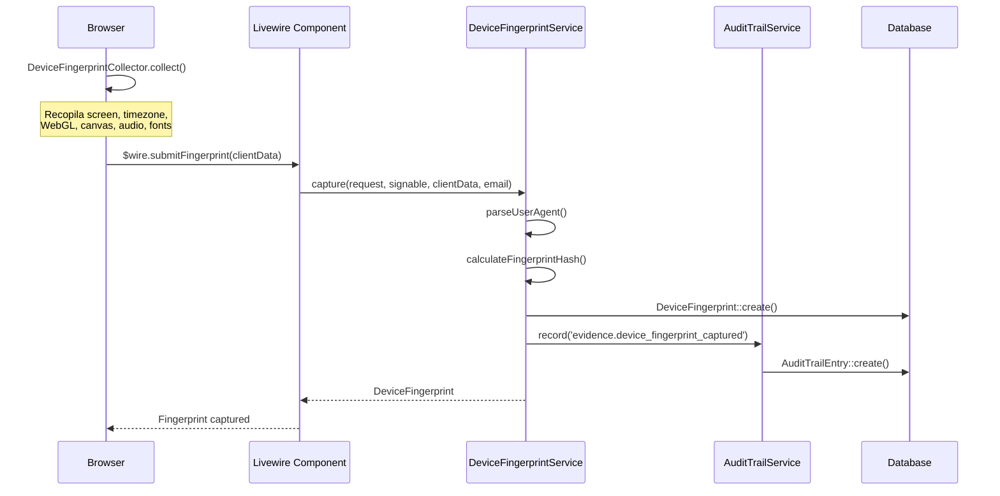
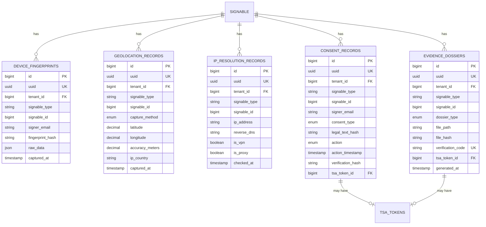

# ADR-006: Sistema de Captura de Evidencias Avanzadas (Sprint 2)

- **Estado**: Aceptado
- **Fecha**: 2025-12-28
- **Backlog Items**: E1-003, E1-004, E1-005, E1-010, E1-007
- **Autor**: Arquitecto de Software
- **Prioridad**: ALTA (Complementa el sistema core de evidencias)
- **Dependencias**: ADR-005 (Sistema de Evidencias Core)

## Contexto

Para que las firmas electrónicas de ANCLA tengan máxima validez legal ante tribunales, el sistema de evidencias core (ADR-005) debe complementarse con **evidencias contextuales** que demuestren:

1. **Identidad del dispositivo**: Huella digital que identifica inequívocamente el dispositivo usado
2. **Ubicación del firmante**: Geolocalización GPS o aproximada por IP
3. **Identificación de red**: IP pública con resolución inversa y detección de proxy/VPN
4. **Consentimiento explícito**: Captura del momento exacto de aceptación legal
5. **Dossier probatorio**: PDF verificable con todas las evidencias consolidadas

Estas evidencias adicionales fortalecen el **no repudio** de las firmas y proporcionan contexto verificable para cualquier disputa legal.

## Requisitos Legales y Normativos

| Requisito | Solución Técnica | Fundamento Legal |
|-----------|------------------|------------------|
| Identificación del dispositivo | Device fingerprint | eIDAS Art. 26.b (datos de creación bajo control exclusivo) |
| Ubicación geográfica | GPS/IP geolocation | RGPD Art. 6.1.b (ejecución de contrato) |
| Registro de IP | IP capture + DNS | Ley 34/2002 LSSI-CE Art. 12 |
| Consentimiento verificable | Checkbox + timestamp + screenshot | RGPD Art. 7 (condiciones para el consentimiento) |
| Prueba consolidada | Dossier PDF firmado | eIDAS Art. 25 (efecto jurídico de firmas electrónicas) |

## Diagrama de Arquitectura Sprint 2

```
┌─────────────────────────────────────────────────────────────────────────────────────┐
│                    SISTEMA DE EVIDENCIAS AVANZADAS (SPRINT 2)                        │
└─────────────────────────────────────────────────────────────────────────────────────┘

┌───────────────────────────────────────────────────────────────────────────────────────┐
│                              CAPA DE CAPTURA (Frontend)                               │
├─────────────────┬─────────────────┬─────────────────┬─────────────────────────────────┤
│ Device          │ Geolocation     │ Consent         │ Screen Capture                  │
│ Fingerprint.js  │ API             │ Component       │ (html2canvas)                   │
│                 │ + IP Fallback   │ (Livewire)      │                                 │
└────────┬────────┴────────┬────────┴────────┬────────┴────────────────┬────────────────┘
         │                 │                 │                          │
         ▼                 ▼                 ▼                          ▼
┌─────────────────────────────────────────────────────────────────────────────────────┐
│                              CAPA DE SERVICIOS (Backend)                             │
├─────────────────┬─────────────────┬─────────────────┬─────────────────┬─────────────┤
│ DeviceFingerprint│ Geolocation    │ IpResolution    │ ConsentCapture  │ Evidence    │
│ Service          │ Service        │ Service         │ Service         │ Dossier     │
│                  │                │                 │                 │ Service     │
│ - capture()      │ - capture()    │ - capture()     │ - record()      │ - generate()│
│ - fingerprint()  │ - fallbackIP() │ - reverseDNS()  │ - screenshot()  │ - sign()    │
│ - hash()         │ - validate()   │ - detectVPN()   │ - verify()      │ - verify()  │
└────────┬─────────┴────────┬───────┴────────┬────────┴────────┬────────┴──────┬──────┘
         │                  │                │                 │               │
         └──────────────────┴────────────────┴─────────────────┴───────────────┘
                                             │
                                             ▼
┌─────────────────────────────────────────────────────────────────────────────────────┐
│                              CAPA DE PERSISTENCIA                                    │
├─────────────────┬─────────────────┬─────────────────┬─────────────────┬─────────────┤
│ device_         │ geolocation_    │ ip_resolution_  │ consent_        │ evidence_   │
│ fingerprints    │ records         │ records         │ records         │ dossiers    │
└─────────────────┴─────────────────┴─────────────────┴─────────────────┴─────────────┘
                                             │
                                             ▼
┌─────────────────────────────────────────────────────────────────────────────────────┐
│                         INTEGRACIÓN CON ADR-005                                      │
│                                                                                      │
│   ┌─────────────────┐  ┌─────────────────┐  ┌─────────────────┐                     │
│   │ AuditTrailService│  │ HashingService  │  │ TsaService      │                     │
│   │ (registro)       │  │ (integridad)    │  │ (timestamp)     │                     │
│   └─────────────────┘  └─────────────────┘  └─────────────────┘                     │
└─────────────────────────────────────────────────────────────────────────────────────┘
```

---

## E1-003: Captura de Huella Digital del Dispositivo

### Descripción

Capturar una huella digital única del dispositivo que permita identificarlo de forma inequívoca. Esta evidencia es crucial para demostrar que la firma se realizó desde un dispositivo específico.

### Datos a Capturar

| Campo | Descripción | Fuente |
|-------|-------------|--------|
| `user_agent` | User-Agent completo del navegador | HTTP Header |
| `browser_name` | Nombre del navegador | Parsed UA |
| `browser_version` | Versión del navegador | Parsed UA |
| `os_name` | Sistema operativo | Parsed UA |
| `os_version` | Versión del SO | Parsed UA |
| `device_type` | Tipo (desktop/mobile/tablet) | Parsed UA |
| `screen_width` | Ancho de pantalla | JavaScript |
| `screen_height` | Alto de pantalla | JavaScript |
| `color_depth` | Profundidad de color | JavaScript |
| `pixel_ratio` | Device pixel ratio | JavaScript |
| `timezone` | Zona horaria | JavaScript |
| `language` | Idioma del navegador | JavaScript |
| `platform` | Plataforma | JavaScript |
| `hardware_concurrency` | Núcleos de CPU | JavaScript |
| `device_memory` | RAM (aprox.) | JavaScript |
| `touch_support` | Soporte táctil | JavaScript |
| `webgl_vendor` | Fabricante GPU | WebGL |
| `webgl_renderer` | Modelo GPU | WebGL |
| `canvas_fingerprint` | Fingerprint canvas | Canvas API |
| `audio_fingerprint` | Fingerprint audio | AudioContext |
| `fonts_detected` | Fuentes instaladas | Canvas/CSS |
| `fingerprint_hash` | Hash único del dispositivo | SHA-256 |

### Diagrama de Secuencia



---

## E1-004: Captura de Geolocalización del Firmante

### Descripción

Capturar la ubicación geográfica del firmante en el momento de la firma. Se solicita permiso GPS primero, y si el usuario rechaza, se usa geolocalización por IP como alternativa.

### Flujo de Decisión

```
┌─────────────────────────────────────────────────────────────────────┐
│                    FLUJO DE CAPTURA GEOLOCALIZACIÓN                  │
└─────────────────────────────────────────────────────────────────────┘
                                    │
                                    ▼
                    ┌───────────────────────────────┐
                    │ ¿Navegador soporta GPS API?   │
                    └───────────────────────────────┘
                          │               │
                         Sí               No
                          │               │
                          ▼               │
        ┌─────────────────────────────┐   │
        │ Solicitar permiso GPS       │   │
        │ navigator.geolocation       │   │
        └─────────────────────────────┘   │
              │         │                 │
          granted    denied               │
              │         │                 │
              ▼         │                 │
    ┌──────────────┐    │                 │
    │ Capturar GPS │    │                 │
    │ lat/long     │    │                 │
    │ accuracy     │    │                 │
    └──────────────┘    │                 │
              │         │                 │
              │         ▼                 ▼
              │    ┌─────────────────────────────┐
              │    │ Fallback: IP Geolocation    │
              │    │ ipapi.co / ipinfo.io        │
              │    └─────────────────────────────┘
              │                  │
              └──────────────────┘
                       │
                       ▼
          ┌─────────────────────────────┐
          │ Guardar GeolocationRecord   │
          │ + Registrar en Audit Trail  │
          └─────────────────────────────┘
```

### Datos Capturados

| Campo | GPS | IP Fallback |
|-------|-----|-------------|
| Latitud | ✅ Alta precisión | ✅ Aproximada |
| Longitud | ✅ Alta precisión | ✅ Aproximada |
| Precisión | ✅ metros | ~ 50km |
| Altitud | ✅ si disponible | ❌ |
| Ciudad | Via geocoding | ✅ |
| País | Via geocoding | ✅ |
| ISP | ❌ | ✅ |
| Timezone | Via offset | ✅ |

---

## E1-005: Registro de IP con Resolución Inversa

### Descripción

Capturar la IP pública del firmante, realizar resolución DNS inversa y detectar si está usando VPN/proxy (informativo, no bloqueante).

### Proceso de Captura

```
┌─────────────────────────────────────────────────────────────────────┐
│                    PROCESO DE RESOLUCIÓN IP                          │
└─────────────────────────────────────────────────────────────────────┘

    HTTP Request
         │
         ▼
┌─────────────────────┐
│ Obtener IP Real     │
│ X-Real-IP >         │
│ X-Forwarded-For >   │
│ REMOTE_ADDR         │
└─────────────────────┘
         │
         ▼
┌─────────────────────┐     ┌─────────────────────┐
│ Resolución DNS      │────▶│ Verificación        │
│ gethostbyaddr()     │     │ Bidireccional       │
│ PTR Record          │     │ hostname → IP       │
└─────────────────────┘     └─────────────────────┘
         │
         ▼
┌─────────────────────┐
│ Información de Red  │
│ - ASN               │
│ - ISP               │
│ - Organization      │
└─────────────────────┘
         │
         ▼
┌─────────────────────┐
│ Detección VPN/Proxy │
│ - is_vpn            │
│ - is_proxy          │
│ - is_tor            │
│ - is_datacenter     │
│ - threat_score      │
└─────────────────────┘
         │
         ▼
┌─────────────────────┐
│ Guardar Record      │
│ + Audit Trail       │
│ (+ warnings si VPN) │
└─────────────────────┘
```

### Proveedores de Detección

| Proveedor | Capacidades | Límite Free |
|-----------|-------------|-------------|
| ipapi.co | ASN, ISP, Geo | 1000/día |
| ipinfo.io | ASN, ISP, Geo, VPN detection | 50k/mes |
| proxycheck.io | VPN, Proxy, Tor, Risk score | 100/día |

---

## E1-010: Captura de Consentimiento Explícito

### Descripción

Registrar el momento exacto en que el firmante acepta el texto legal, incluyendo:
- Checkbox de aceptación obligatorio
- Texto legal visible
- Timestamp preciso del click
- Screenshot del momento de aceptación

### Componentes de Captura

```
┌─────────────────────────────────────────────────────────────────────┐
│                    CAPTURA DE CONSENTIMIENTO                         │
└─────────────────────────────────────────────────────────────────────┘

    ┌───────────────────────────────────────────────────────────────┐
    │                    CONSENT CONTAINER                           │
    │                                                               │
    │   ┌─────────────────────────────────────────────────────────┐ │
    │   │                    LEGAL TEXT                            │ │
    │   │                                                         │ │
    │   │  Al hacer click en "Acepto", usted confirma que:        │ │
    │   │  - Ha leído y comprende el documento presentado         │ │
    │   │  - Acepta firmar electrónicamente este documento        │ │
    │   │  - Reconoce la validez legal de su firma electrónica    │ │
    │   │  - Autoriza el registro de evidencias de este proceso   │ │
    │   │                                                         │ │
    │   │  [Hash del texto: abc123...] [Versión: 1.0]            │ │
    │   │                                                         │ │
    │   └─────────────────────────────────────────────────────────┘ │
    │                                                               │
    │   ☑ He leído y acepto los términos anteriores               │
    │                                                               │
    │                    [ ACEPTO Y FIRMO ]                         │
    │                                                               │
    └───────────────────────────────────────────────────────────────┘
                              │
                              │ Click "Acepto"
                              ▼
    ┌───────────────────────────────────────────────────────────────┐
    │                    DATOS CAPTURADOS                           │
    ├───────────────────────────────────────────────────────────────┤
    │ • Timestamp exacto (microsegundos)                            │
    │ • Hash SHA-256 del texto legal                                │
    │ • Versión del texto legal                                     │
    │ • Screenshot del contenedor (html2canvas)                     │
    │ • Tiempo que estuvo visible el texto                          │
    │ • Si scrolleó hasta el final                                  │
    │ • ID del elemento checkbox                                    │
    │ • TSA timestamp del consentimiento                            │
    └───────────────────────────────────────────────────────────────┘
```

### Verificación de Integridad

El consentimiento se verifica mediante:
1. **Hash del texto legal**: Garantiza que el texto mostrado no cambió
2. **Hash de verificación**: Combina todos los datos del consentimiento
3. **TSA Token**: Prueba temporal cualificada del momento de aceptación
4. **Screenshot**: Evidencia visual del estado de la UI

---

## E1-007: Exportación de Dossier Probatorio PDF

### Descripción

Generar un PDF verificable que contenga todas las evidencias del proceso de firma:
- Audit trail completo con eventos
- Hashes de documentos verificables
- Tokens TSA embebidos
- Datos de dispositivos e IPs
- Firma del dossier con sello de la plataforma

### Estructura del PDF

```
┌─────────────────────────────────────────────────────────────────────┐
│                         DOSSIER PROBATORIO                          │
│                              ANCLA                                  │
├─────────────────────────────────────────────────────────────────────┤
│                                                                     │
│  PÁGINA 1: PORTADA                                                  │
│  ├── Logo ANCLA + Logo Tenant                                       │
│  ├── Título: "Dossier de Evidencias"                               │
│  ├── Código de verificación: XXXX-XXXX-XXXX                        │
│  ├── QR de verificación                                            │
│  ├── Fecha de generación                                           │
│  └── Hash del documento                                            │
│                                                                     │
│  PÁGINA 2: RESUMEN EJECUTIVO                                        │
│  ├── Información del documento                                      │
│  ├── Firmantes y estados                                           │
│  ├── Timeline visual                                               │
│  └── Resultado de verificación                                     │
│                                                                     │
│  PÁGINA 3-N: AUDIT TRAIL                                            │
│  ├── Tabla de eventos                                              │
│  │   ├── # | Timestamp | Evento | Actor | IP | Hash                │
│  │   ├── 1 | 2025-01-01 10:00:00 | document.uploaded | user@... |  │
│  │   ├── 2 | 2025-01-01 10:05:00 | signer.invited | system |       │
│  │   └── ...                                                       │
│  └── Verificación de cadena de hashes                              │
│                                                                     │
│  PÁGINA N+1: DISPOSITIVOS                                           │
│  ├── Tabla de fingerprints                                         │
│  │   ├── Signer | Browser | OS | Screen | Fingerprint Hash        │
│  │   └── ...                                                       │
│  └── Detalles por dispositivo                                      │
│                                                                     │
│  PÁGINA N+2: GEOLOCALIZACIÓN                                        │
│  ├── Mapa (si disponible)                                          │
│  ├── Tabla de ubicaciones                                          │
│  │   ├── Signer | Method | Lat/Long | Accuracy | Country/City     │
│  │   └── ...                                                       │
│  └── Notas sobre precisión                                         │
│                                                                     │
│  PÁGINA N+3: INFORMACIÓN DE RED                                     │
│  ├── Tabla de IPs                                                  │
│  │   ├── Signer | IP | Reverse DNS | ISP | VPN/Proxy | Warnings   │
│  │   └── ...                                                       │
│  └── Avisos de seguridad (si los hay)                             │
│                                                                     │
│  PÁGINA N+4: CONSENTIMIENTOS                                        │
│  ├── Lista de consentimientos                                      │
│  │   ├── Signer | Type | Action | Timestamp | Text Hash | TSA     │
│  │   └── ...                                                       │
│  └── Screenshots de consentimiento (miniatura)                     │
│                                                                     │
│  PÁGINA FINAL: CERTIFICACIÓN                                        │
│  ├── Firma digital de ANCLA                                        │
│  ├── TSA Token del dossier                                         │
│  ├── Hash del PDF                                                  │
│  ├── Instrucciones de verificación                                 │
│  └── Aviso legal                                                   │
│                                                                     │
└─────────────────────────────────────────────────────────────────────┘
```

### Verificación del Dossier

El dossier puede verificarse de tres formas:

1. **Online**: Visitar URL con código de verificación
2. **QR Code**: Escanear QR en la portada
3. **Manual**: Recalcular hash SHA-256 y comparar

---

## Diseño de Base de Datos

### Nuevas Tablas

#### 1. device_fingerprints

```sql
CREATE TABLE device_fingerprints (
    id                   BIGINT UNSIGNED PRIMARY KEY AUTO_INCREMENT,
    uuid                 CHAR(36) NOT NULL UNIQUE,
    tenant_id            BIGINT UNSIGNED NOT NULL,
    
    -- Contexto de captura
    signable_type        VARCHAR(100) NOT NULL,
    signable_id          BIGINT UNSIGNED NOT NULL,
    signer_id            BIGINT UNSIGNED NULL,
    signer_email         VARCHAR(255) NULL,
    
    -- User Agent parsed
    user_agent_raw       TEXT NOT NULL,
    browser_name         VARCHAR(100) NULL,
    browser_version      VARCHAR(50) NULL,
    os_name              VARCHAR(100) NULL,
    os_version           VARCHAR(50) NULL,
    device_type          ENUM('desktop', 'mobile', 'tablet', 'unknown') DEFAULT 'unknown',
    
    -- Screen info
    screen_width         INT UNSIGNED NULL,
    screen_height        INT UNSIGNED NULL,
    color_depth          SMALLINT UNSIGNED NULL,
    pixel_ratio          DECIMAL(4,2) NULL,
    
    -- Environment
    timezone             VARCHAR(100) NULL,
    timezone_offset      SMALLINT NULL,
    language             VARCHAR(20) NULL,
    languages            JSON NULL,
    platform             VARCHAR(100) NULL,
    
    -- Hardware hints
    hardware_concurrency TINYINT UNSIGNED NULL,
    device_memory        DECIMAL(5,2) NULL,
    touch_support        BOOLEAN DEFAULT FALSE,
    touch_points         TINYINT UNSIGNED NULL,
    
    -- Graphics
    webgl_vendor         VARCHAR(255) NULL,
    webgl_renderer       VARCHAR(255) NULL,
    
    -- Advanced fingerprints
    canvas_hash          CHAR(64) NULL,
    audio_hash           CHAR(64) NULL,
    fonts_hash           CHAR(64) NULL,
    
    -- Final fingerprint
    fingerprint_hash     CHAR(64) NOT NULL,
    fingerprint_version  VARCHAR(10) DEFAULT 'v1',
    
    -- Metadata
    raw_data             JSON NULL,
    captured_at          TIMESTAMP(6) DEFAULT CURRENT_TIMESTAMP(6),
    
    INDEX idx_fingerprint_tenant (tenant_id),
    INDEX idx_fingerprint_signable (signable_type, signable_id),
    INDEX idx_fingerprint_hash (fingerprint_hash),
    INDEX idx_fingerprint_signer (signer_email),
    
    FOREIGN KEY (tenant_id) REFERENCES tenants(id) ON DELETE CASCADE
);
```

#### 2. geolocation_records

```sql
CREATE TABLE geolocation_records (
    id                   BIGINT UNSIGNED PRIMARY KEY AUTO_INCREMENT,
    uuid                 CHAR(36) NOT NULL UNIQUE,
    tenant_id            BIGINT UNSIGNED NOT NULL,
    
    -- Contexto
    signable_type        VARCHAR(100) NOT NULL,
    signable_id          BIGINT UNSIGNED NOT NULL,
    signer_id            BIGINT UNSIGNED NULL,
    signer_email         VARCHAR(255) NULL,
    
    -- Tipo de captura
    capture_method       ENUM('gps', 'ip', 'refused', 'unavailable') NOT NULL,
    permission_status    ENUM('granted', 'denied', 'prompt', 'unavailable') NOT NULL,
    
    -- Datos GPS
    latitude             DECIMAL(10, 8) NULL,
    longitude            DECIMAL(11, 8) NULL,
    accuracy_meters      DECIMAL(10, 2) NULL,
    altitude_meters      DECIMAL(10, 2) NULL,
    
    -- Datos IP geolocation
    ip_latitude          DECIMAL(10, 8) NULL,
    ip_longitude         DECIMAL(11, 8) NULL,
    ip_city              VARCHAR(100) NULL,
    ip_region            VARCHAR(100) NULL,
    ip_country           VARCHAR(2) NULL,
    ip_country_name      VARCHAR(100) NULL,
    ip_timezone          VARCHAR(100) NULL,
    ip_isp               VARCHAR(255) NULL,
    
    -- Dirección formateada
    formatted_address    TEXT NULL,
    
    -- Metadata
    raw_gps_data         JSON NULL,
    raw_ip_data          JSON NULL,
    captured_at          TIMESTAMP(6) DEFAULT CURRENT_TIMESTAMP(6),
    
    INDEX idx_geo_tenant (tenant_id),
    INDEX idx_geo_signable (signable_type, signable_id),
    INDEX idx_geo_method (capture_method),
    INDEX idx_geo_country (ip_country),
    
    FOREIGN KEY (tenant_id) REFERENCES tenants(id) ON DELETE CASCADE
);
```

#### 3. ip_resolution_records

```sql
CREATE TABLE ip_resolution_records (
    id                   BIGINT UNSIGNED PRIMARY KEY AUTO_INCREMENT,
    uuid                 CHAR(36) NOT NULL UNIQUE,
    tenant_id            BIGINT UNSIGNED NOT NULL,
    
    -- Contexto
    signable_type        VARCHAR(100) NOT NULL,
    signable_id          BIGINT UNSIGNED NOT NULL,
    signer_id            BIGINT UNSIGNED NULL,
    signer_email         VARCHAR(255) NULL,
    
    -- IP
    ip_address           VARCHAR(45) NOT NULL,
    ip_version           TINYINT NOT NULL,
    
    -- DNS inversa
    reverse_dns          VARCHAR(255) NULL,
    reverse_dns_verified BOOLEAN DEFAULT FALSE,
    
    -- Red
    asn                  VARCHAR(20) NULL,
    asn_name             VARCHAR(255) NULL,
    isp                  VARCHAR(255) NULL,
    organization         VARCHAR(255) NULL,
    
    -- Detección proxy/VPN
    is_proxy             BOOLEAN DEFAULT FALSE,
    is_vpn               BOOLEAN DEFAULT FALSE,
    is_tor               BOOLEAN DEFAULT FALSE,
    is_datacenter        BOOLEAN DEFAULT FALSE,
    proxy_type           VARCHAR(50) NULL,
    threat_score         TINYINT NULL,
    
    -- Headers
    x_forwarded_for      TEXT NULL,
    x_real_ip            VARCHAR(45) NULL,
    
    -- Metadata
    raw_data             JSON NULL,
    checked_at           TIMESTAMP(6) DEFAULT CURRENT_TIMESTAMP(6),
    
    INDEX idx_ip_tenant (tenant_id),
    INDEX idx_ip_signable (signable_type, signable_id),
    INDEX idx_ip_address (ip_address),
    INDEX idx_ip_vpn (is_vpn),
    INDEX idx_ip_proxy (is_proxy),
    
    FOREIGN KEY (tenant_id) REFERENCES tenants(id) ON DELETE CASCADE
);
```

#### 4. consent_records

```sql
CREATE TABLE consent_records (
    id                   BIGINT UNSIGNED PRIMARY KEY AUTO_INCREMENT,
    uuid                 CHAR(36) NOT NULL UNIQUE,
    tenant_id            BIGINT UNSIGNED NOT NULL,
    
    -- Contexto
    signable_type        VARCHAR(100) NOT NULL,
    signable_id          BIGINT UNSIGNED NOT NULL,
    signer_id            BIGINT UNSIGNED NULL,
    signer_email         VARCHAR(255) NOT NULL,
    
    -- Tipo de consentimiento
    consent_type         ENUM('signature', 'terms', 'privacy', 'biometric', 'communication') NOT NULL,
    consent_version      VARCHAR(20) NOT NULL,
    
    -- Texto legal
    legal_text_hash      CHAR(64) NOT NULL,
    legal_text_content   MEDIUMTEXT NOT NULL,
    legal_text_language  VARCHAR(10) DEFAULT 'es',
    
    -- Acción
    action               ENUM('accepted', 'rejected', 'revoked') NOT NULL,
    action_timestamp     TIMESTAMP(6) NOT NULL,
    
    -- Screenshot
    screenshot_path      VARCHAR(500) NULL,
    screenshot_hash      CHAR(64) NULL,
    screenshot_captured_at TIMESTAMP(6) NULL,
    
    -- Contexto UI
    ui_element_id        VARCHAR(100) NULL,
    ui_visible_duration_ms INT UNSIGNED NULL,
    scroll_to_bottom     BOOLEAN DEFAULT FALSE,
    
    -- Verificación
    verification_hash    CHAR(64) NOT NULL,
    tsa_token_id         BIGINT UNSIGNED NULL,
    
    created_at           TIMESTAMP DEFAULT CURRENT_TIMESTAMP,
    
    INDEX idx_consent_tenant (tenant_id),
    INDEX idx_consent_signable (signable_type, signable_id),
    INDEX idx_consent_signer (signer_email),
    INDEX idx_consent_type (consent_type),
    INDEX idx_consent_hash (verification_hash),
    
    FOREIGN KEY (tenant_id) REFERENCES tenants(id) ON DELETE CASCADE,
    FOREIGN KEY (tsa_token_id) REFERENCES tsa_tokens(id)
);
```

#### 5. evidence_dossiers

```sql
CREATE TABLE evidence_dossiers (
    id                   BIGINT UNSIGNED PRIMARY KEY AUTO_INCREMENT,
    uuid                 CHAR(36) NOT NULL UNIQUE,
    tenant_id            BIGINT UNSIGNED NOT NULL,
    
    -- Contexto
    signable_type        VARCHAR(100) NOT NULL,
    signable_id          BIGINT UNSIGNED NOT NULL,
    
    -- Tipo
    dossier_type         ENUM('audit_trail', 'full_evidence', 'legal_proof', 'executive_summary') NOT NULL,
    
    -- Archivo PDF
    file_path            VARCHAR(500) NOT NULL,
    file_name            VARCHAR(255) NOT NULL,
    file_size            BIGINT UNSIGNED NOT NULL,
    file_hash            CHAR(64) NOT NULL,
    page_count           INT UNSIGNED NOT NULL,
    
    -- Contenido incluido
    includes_document    BOOLEAN DEFAULT TRUE,
    includes_audit_trail BOOLEAN DEFAULT TRUE,
    includes_device_info BOOLEAN DEFAULT TRUE,
    includes_geolocation BOOLEAN DEFAULT TRUE,
    includes_ip_info     BOOLEAN DEFAULT TRUE,
    includes_consents    BOOLEAN DEFAULT TRUE,
    includes_tsa_tokens  BOOLEAN DEFAULT TRUE,
    
    -- Firma del dossier
    platform_signature   TEXT NULL,
    signature_algorithm  VARCHAR(50) NULL,
    signed_at            TIMESTAMP(6) NULL,
    
    -- TSA
    tsa_token_id         BIGINT UNSIGNED NULL,
    
    -- Verificación
    verification_code    VARCHAR(20) NOT NULL UNIQUE,
    verification_url     VARCHAR(500) NULL,
    verification_qr_path VARCHAR(500) NULL,
    
    -- Contadores
    audit_entries_count  INT UNSIGNED DEFAULT 0,
    devices_count        INT UNSIGNED DEFAULT 0,
    geolocations_count   INT UNSIGNED DEFAULT 0,
    consents_count       INT UNSIGNED DEFAULT 0,
    
    -- Generación
    generated_by         BIGINT UNSIGNED NULL,
    generated_at         TIMESTAMP DEFAULT CURRENT_TIMESTAMP,
    
    -- Descargas
    download_count       INT UNSIGNED DEFAULT 0,
    last_downloaded_at   TIMESTAMP NULL,
    
    INDEX idx_dossier_tenant (tenant_id),
    INDEX idx_dossier_signable (signable_type, signable_id),
    INDEX idx_dossier_verification (verification_code),
    
    FOREIGN KEY (tenant_id) REFERENCES tenants(id) ON DELETE CASCADE,
    FOREIGN KEY (tsa_token_id) REFERENCES tsa_tokens(id),
    FOREIGN KEY (generated_by) REFERENCES users(id)
);
```

### Diagrama ERD



---

## Lista de Archivos a Crear

### Migraciones

| # | Archivo | Descripción |
|---|---------|-------------|
| 1 | `database/migrations/2025_01_01_000030_create_device_fingerprints_table.php` | Tabla de fingerprints |
| 2 | `database/migrations/2025_01_01_000031_create_geolocation_records_table.php` | Tabla de geolocalización |
| 3 | `database/migrations/2025_01_01_000032_create_ip_resolution_records_table.php` | Tabla de resolución IP |
| 4 | `database/migrations/2025_01_01_000033_create_consent_records_table.php` | Tabla de consentimientos |
| 5 | `database/migrations/2025_01_01_000034_create_evidence_dossiers_table.php` | Tabla de dossiers |

### Modelos

| # | Archivo | Descripción |
|---|---------|-------------|
| 6 | `app/Models/DeviceFingerprint.php` | Modelo de fingerprint |
| 7 | `app/Models/GeolocationRecord.php` | Modelo de geolocalización |
| 8 | `app/Models/IpResolutionRecord.php` | Modelo de resolución IP |
| 9 | `app/Models/ConsentRecord.php` | Modelo de consentimiento |
| 10 | `app/Models/EvidenceDossier.php` | Modelo de dossier |

### Servicios

| # | Archivo | Descripción |
|---|---------|-------------|
| 11 | `app/Services/Evidence/DeviceFingerprintService.php` | Servicio de fingerprint |
| 12 | `app/Services/Evidence/GeolocationService.php` | Servicio de geolocalización |
| 13 | `app/Services/Evidence/IpResolutionService.php` | Servicio de resolución IP |
| 14 | `app/Services/Evidence/ConsentCaptureService.php` | Servicio de consentimiento |
| 15 | `app/Services/Evidence/EvidenceDossierService.php` | Servicio de dossier PDF |

### Componentes Livewire

| # | Archivo | Descripción |
|---|---------|-------------|
| 16 | `app/Livewire/Evidence/ConsentCheckbox.php` | Componente de consentimiento |
| 17 | `app/Livewire/Evidence/EvidenceCollector.php` | Componente recopilador |

### Vistas

| # | Archivo | Descripción |
|---|---------|-------------|
| 18 | `resources/views/livewire/evidence/consent-checkbox.blade.php` | Vista consentimiento |
| 19 | `resources/views/evidence/dossier-pdf.blade.php` | Template PDF dossier |
| 20 | `resources/views/evidence/verify.blade.php` | Página verificación |

### JavaScript (Frontend)

| # | Archivo | Descripción |
|---|---------|-------------|
| 21 | `resources/js/evidence/device-fingerprint.js` | Collector fingerprint |
| 22 | `resources/js/evidence/geolocation.js` | Collector geolocation |
| 23 | `resources/js/evidence/consent-screenshot.js` | Captura screenshot |

### Configuración

| # | Archivo | Descripción |
|---|---------|-------------|
| 24 | `config/evidence.php` | Añadir nuevas configuraciones |

### Tests

| # | Archivo | Descripción |
|---|---------|-------------|
| 25 | `tests/Unit/Evidence/DeviceFingerprintServiceTest.php` | Tests fingerprint |
| 26 | `tests/Unit/Evidence/GeolocationServiceTest.php` | Tests geolocation |
| 27 | `tests/Unit/Evidence/IpResolutionServiceTest.php` | Tests IP resolution |
| 28 | `tests/Unit/Evidence/ConsentCaptureServiceTest.php` | Tests consent |
| 29 | `tests/Unit/Evidence/EvidenceDossierServiceTest.php` | Tests dossier |
| 30 | `tests/Feature/Evidence/EvidenceCollectionFlowTest.php` | Tests integración |

---

## Configuración Adicional

### Añadir a config/evidence.php

```php
<?php
// Añadir las siguientes secciones a config/evidence.php

return [
    // ... configuración existente ...
    
    /*
    |--------------------------------------------------------------------------
    | Geolocation Configuration
    |--------------------------------------------------------------------------
    */
    'geolocation' => [
        'ip_provider' => env('GEOLOCATION_IP_PROVIDER', 'ipapi'),
        'ipinfo_token' => env('IPINFO_TOKEN'),
        'request_gps' => true,
        'gps_timeout' => 10000, // ms
        'high_accuracy' => true,
    ],
    
    /*
    |--------------------------------------------------------------------------
    | IP Resolution Configuration
    |--------------------------------------------------------------------------
    */
    'ip_info' => [
        'provider' => env('IP_INFO_PROVIDER', 'ipapi'),
        'proxycheck_key' => env('PROXYCHECK_API_KEY'),
        'detect_vpn' => true,
        'detect_proxy' => true,
    ],
    
    /*
    |--------------------------------------------------------------------------
    | Consent Capture Configuration
    |--------------------------------------------------------------------------
    */
    'consent' => [
        'capture_screenshot' => true,
        'screenshot_format' => 'png',
        'screenshot_quality' => 0.9,
        'require_scroll' => false,
        'tsa_required' => true,
    ],
    
    'consent_texts' => [
        'signature' => [
            'es' => 'Al hacer click en "Acepto", usted confirma que ha leído y comprende el documento presentado, acepta firmarlo electrónicamente, reconoce la validez legal de su firma electrónica según el Reglamento eIDAS (UE) 910/2014, y autoriza el registro de evidencias de este proceso.',
            'en' => 'By clicking "Accept", you confirm that you have read and understand the presented document, agree to sign it electronically, acknowledge the legal validity of your electronic signature under eIDAS Regulation (EU) 910/2014, and authorize the recording of evidence of this process.',
        ],
        'terms' => [
            'es' => 'He leído y acepto los Términos y Condiciones del servicio.',
            'en' => 'I have read and accept the Terms and Conditions of the service.',
        ],
        'privacy' => [
            'es' => 'He leído y acepto la Política de Privacidad.',
            'en' => 'I have read and accept the Privacy Policy.',
        ],
    ],
    
    'consent_versions' => [
        'signature' => '1.0',
        'terms' => '1.0',
        'privacy' => '1.0',
    ],
    
    /*
    |--------------------------------------------------------------------------
    | Evidence Dossier Configuration
    |--------------------------------------------------------------------------
    */
    'dossier' => [
        'storage_disk' => 'local',
        'path_prefix' => 'evidence-dossiers',
        'platform_signing_key' => env('EVIDENCE_PLATFORM_SIGNING_KEY'),
        'include_qr' => true,
        'qr_size' => 200,
    ],
    
    /*
    |--------------------------------------------------------------------------
    | Device Fingerprint Configuration
    |--------------------------------------------------------------------------
    */
    'fingerprint' => [
        'version' => 'v1',
        'collect_canvas' => true,
        'collect_audio' => true,
        'collect_fonts' => true,
        'collect_webgl' => true,
    ],
];
```

### Variables de Entorno

```env
# .env.example - Añadir

# Geolocation
GEOLOCATION_IP_PROVIDER=ipapi
IPINFO_TOKEN=

# IP Resolution
IP_INFO_PROVIDER=ipapi
PROXYCHECK_API_KEY=

# Evidence Dossier
EVIDENCE_PLATFORM_SIGNING_KEY=your-secret-signing-key-here
```

---

## Dependencias de Composer/NPM

### Composer (PHP)

```bash
# User-Agent parsing
composer require jenssegers/agent

# PDF generation
composer require barryvdh/laravel-dompdf

# QR Code generation
composer require simplesoftwareio/simple-qrcode
```

### NPM (JavaScript)

```bash
# Screenshot capture
npm install html2canvas
```

---

## Consecuencias

### Positivas

- ✅ **Máxima evidencia legal**: Captura completa del contexto de firma
- ✅ **No repudio reforzado**: Múltiples puntos de identificación
- ✅ **Verificabilidad offline**: Dossier PDF autónomo
- ✅ **Cumplimiento eIDAS+RGPD**: Consentimiento documentado
- ✅ **Detección de fraude**: Fingerprint y VPN detection
- ✅ **Trazabilidad completa**: Todo queda en audit trail

### Negativas

- ⚠️ **Privacidad**: Recopilación extensiva de datos (mitigado con consentimiento)
- ⚠️ **Storage**: Screenshots y dossiers consumen espacio
- ⚠️ **Complejidad**: Múltiples servicios a coordinar
- ⚠️ **Dependencias externas**: APIs de geolocalización y VPN detection

### Riesgos y Mitigaciones

| Riesgo | Probabilidad | Impacto | Mitigación |
|--------|--------------|---------|------------|
| Usuario rechaza GPS | Alta | Bajo | Fallback a IP geolocation |
| API de geolocation caída | Baja | Medio | Múltiples proveedores |
| Fingerprint evasion | Media | Bajo | Es informativo, no bloqueante |
| Storage lleno | Media | Medio | Política de retención, compresión |
| Screenshot falla | Media | Bajo | Continuar sin screenshot |

---

## Plan de Implementación

### Fase 1: Infraestructura (1-2 días)
1. ☐ Crear migraciones (5 tablas)
2. ☐ Crear modelos (5 modelos)
3. ☐ Actualizar config/evidence.php
4. ☐ Instalar dependencias (composer + npm)

### Fase 2: Servicios Backend (3-4 días)
5. ☐ Implementar DeviceFingerprintService
6. ☐ Implementar GeolocationService
7. ☐ Implementar IpResolutionService
8. ☐ Implementar ConsentCaptureService
9. ☐ Implementar EvidenceDossierService

### Fase 3: Frontend JavaScript (2 días)
10. ☐ Implementar DeviceFingerprintCollector
11. ☐ Implementar GeolocationCollector
12. ☐ Implementar ConsentScreenshotCapture
13. ☐ Integrar con Livewire components

### Fase 4: Componentes Livewire (2 días)
14. ☐ Crear ConsentCheckbox component
15. ☐ Crear EvidenceCollector component
16. ☐ Crear vistas Blade asociadas

### Fase 5: PDF Dossier (2 días)
17. ☐ Crear template dossier-pdf.blade.php
18. ☐ Implementar generación QR
19. ☐ Crear página de verificación
20. ☐ Implementar firma de plataforma

### Fase 6: Testing (2-3 días)
21. ☐ Tests unitarios de servicios
22. ☐ Tests de integración del flujo completo
23. ☐ Tests de verificación de dossier

---

## Referencias

- [eIDAS Regulation (EU) 910/2014](https://eur-lex.europa.eu/legal-content/EN/TXT/?uri=uriserv:OJ.L_.2014.257.01.0073.01.ENG)
- [RGPD - Reglamento (UE) 2016/679](https://eur-lex.europa.eu/eli/reg/2016/679/oj)
- [FingerprintJS Documentation](https://fingerprint.com/docs/)
- [W3C Geolocation API](https://www.w3.org/TR/geolocation/)
- [RFC 3161 - Time-Stamp Protocol](https://www.rfc-editor.org/rfc/rfc3161)
- ADR-005: Sistema de Evidencias Core

---

**LISTO PARA DESARROLLO**
