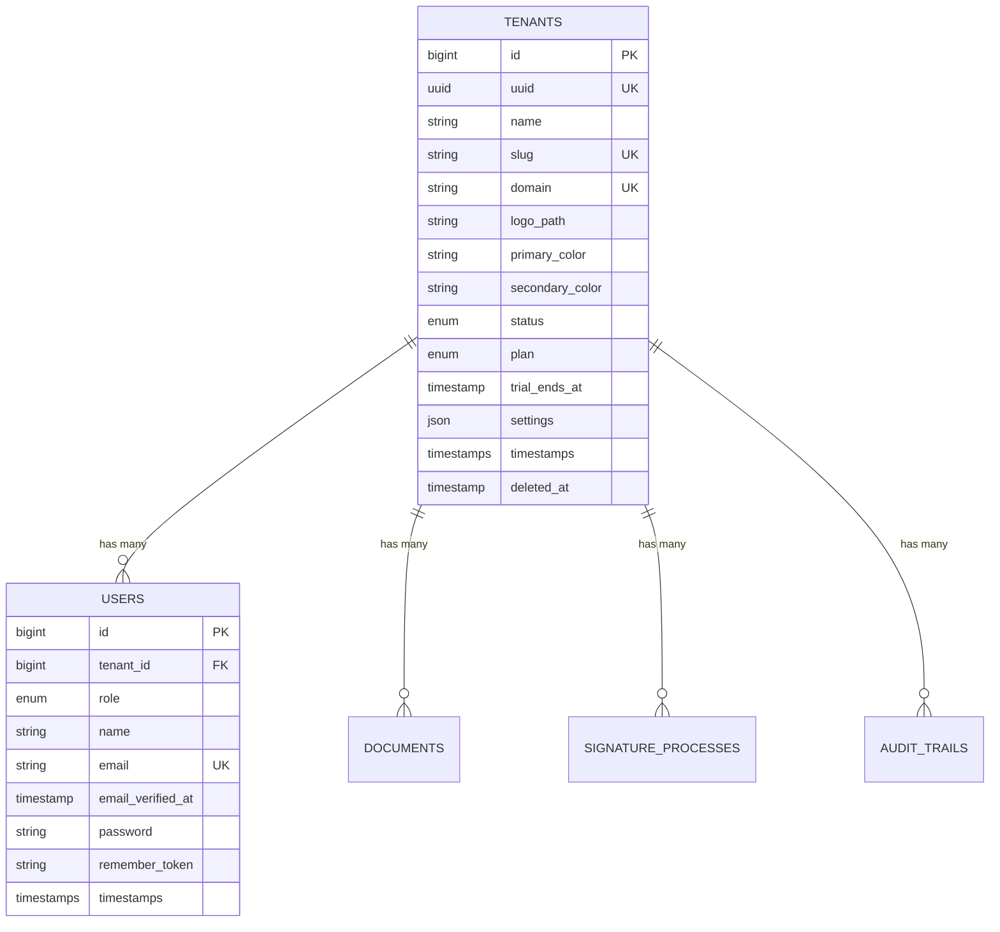
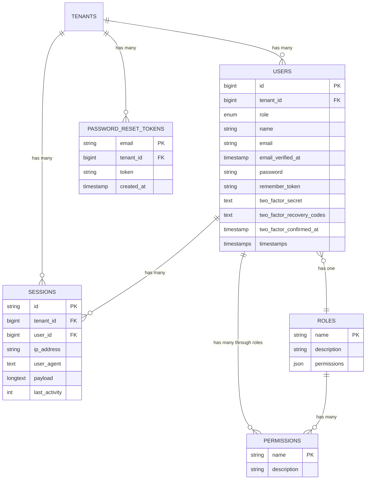
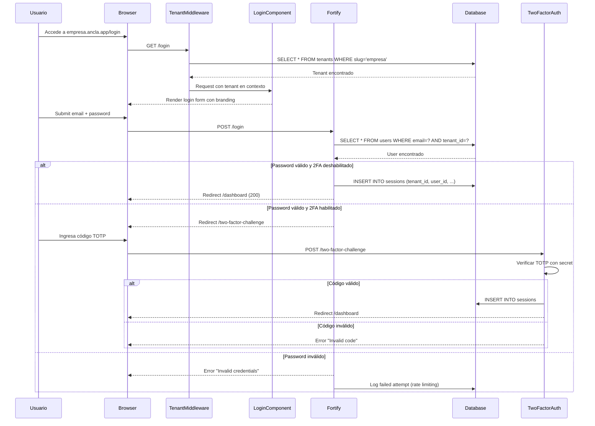
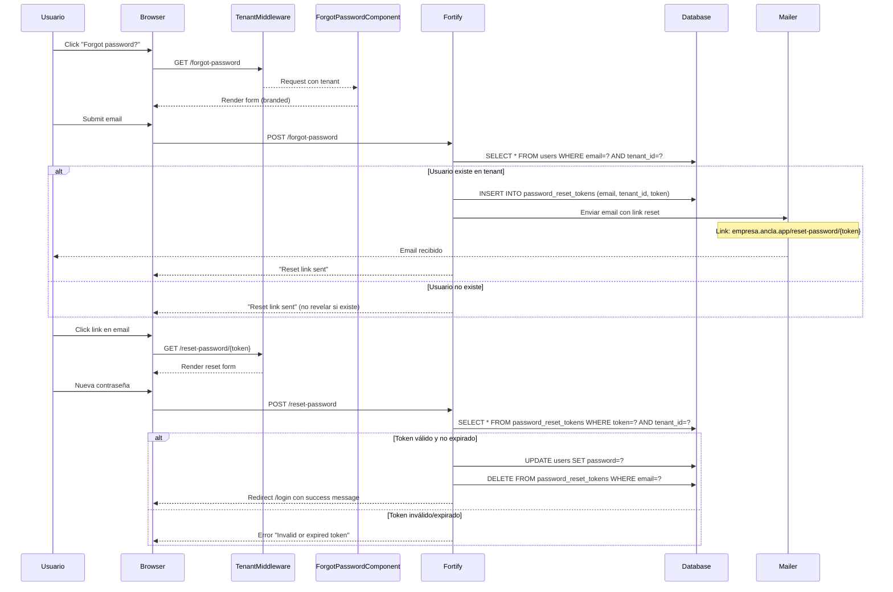
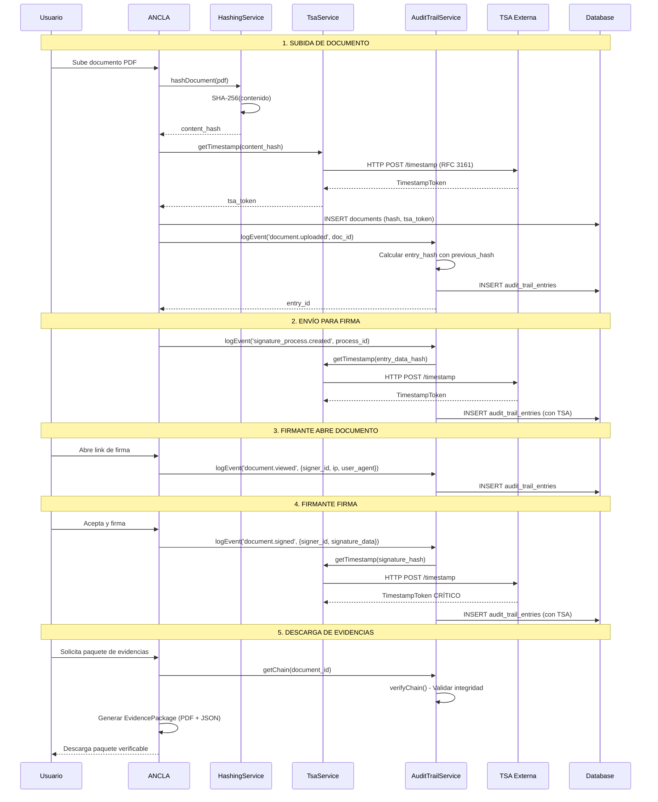
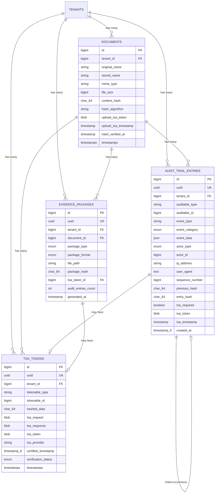

# Architecture Decision Records (ADR)

## ADR-001: Selección del Stack Tecnológico
- **Estado**: Aceptado
- **Contexto**: Necesitamos un framework robusto y rápido para desarrollo web.
- **Decisión**: Usar Laravel, Livewire, Tailwind CSS y Blade.
- **Consecuencias**: Desarrollo rápido, pero requiere conocimiento específico de Livewire.

## ADR-002: Estructura de Agentes
- **Estado**: Aceptado
- **Contexto**: El desarrollo será autónomo.
- **Decisión**: Usar roles definidos (PO, Arquitecto, Dev, Seguridad) en `.squads/shared/roles`.

---

## ADR-003: Arquitectura Multi-tenant de Base de Datos

- **Estado**: Aceptado
- **Fecha**: 2025-12-28
- **Backlog Item**: E0-004
- **Autor**: Arquitecto de Software

### Contexto

ANCLA es una plataforma SaaS de firma electrónica que opera como **marca blanca (white-label)**. Múltiples organizaciones (tenants) usarán la plataforma, cada una con:
- Sus propios usuarios
- Sus propios documentos
- Sus propias configuraciones de marca
- Posibilidad de dominio personalizado

Necesitamos una estrategia de aislamiento de datos que garantice:
1. **Seguridad**: Un tenant nunca puede acceder a datos de otro
2. **Escalabilidad**: Soporte para cientos de tenants
3. **Rendimiento**: Queries eficientes
4. **Simplicidad**: Mantenimiento de una sola base de datos

### Opciones Consideradas

| Estrategia | Descripción | Pros | Contras |
|------------|-------------|------|---------|
| **Base de datos separada** | Una BD por tenant | Aislamiento total, backup individual | Complejidad de gestión, alto coste |
| **Schema separado** | Un schema por tenant | Buen aislamiento | No soportado nativamente en MySQL |
| **Columna tenant_id** | Discriminador en cada tabla | Simple, eficiente, fácil de implementar | Requiere disciplina en queries |

### Decisión

**Usaremos la estrategia de columna `tenant_id`** (Single Database, Shared Schema) por las siguientes razones:

1. **Simplicidad operativa**: Una sola base de datos simplifica backups, migraciones y mantenimiento
2. **Coste efectivo**: No requiere recursos adicionales por tenant
3. **Compatible con Laravel**: Fácil implementación con Global Scopes y Traits
4. **Escalabilidad horizontal**: Podemos escalar con réplicas de lectura
5. **White-label friendly**: Resolución por subdominio/dominio funciona perfectamente

### Estrategia de Resolución de Tenant

El tenant se identificará mediante **subdomain-first con fallback a header**:

```
Prioridad de resolución:
1. Subdominio: empresa.ancla.app → tenant "empresa"
2. Dominio personalizado: firma.empresa.com → buscar en tabla tenants
3. Header X-Tenant-ID: Para APIs internas/testing
```

### Diagrama de Arquitectura

```
┌─────────────────────────────────────────────────────────────────────┐
│                        Request HTTP                                  │
│              empresa.ancla.app/documentos                           │
└─────────────────────────────────────────────────────────────────────┘
                                │
                                ▼
┌─────────────────────────────────────────────────────────────────────┐
│                     TenantMiddleware                                 │
│  1. Extraer subdominio/dominio de la request                        │
│  2. Buscar tenant en BD (con cache)                                 │
│  3. Almacenar en TenantContext (singleton)                          │
│  4. Si no existe → 404 o redirect                                   │
└─────────────────────────────────────────────────────────────────────┘
                                │
                                ▼
┌─────────────────────────────────────────────────────────────────────┐
│                       Aplicación Laravel                            │
│  - Modelos con BelongsToTenant trait                                │
│  - Global Scope añade WHERE tenant_id = X automáticamente           │
│  - Observer asigna tenant_id en creación                            │
└─────────────────────────────────────────────────────────────────────┘
                                │
                                ▼
┌─────────────────────────────────────────────────────────────────────┐
│                        Base de Datos                                 │
│  ┌──────────┐  ┌──────────┐  ┌──────────┐  ┌──────────────┐         │
│  │ tenants  │  │  users   │  │documents │  │ audit_trails │         │
│  │          │  │tenant_id │  │tenant_id │  │  tenant_id   │         │
│  └──────────┘  └──────────┘  └──────────┘  └──────────────┘         │
└─────────────────────────────────────────────────────────────────────┘
```

---

## Diseño Técnico Detallado

### 1. Estructura de Tablas Base

#### Tabla `tenants` (Organizaciones)

```sql
CREATE TABLE tenants (
    id               BIGINT UNSIGNED PRIMARY KEY AUTO_INCREMENT,
    uuid             CHAR(36) NOT NULL UNIQUE,
    name             VARCHAR(255) NOT NULL,              -- Nombre de la empresa
    slug             VARCHAR(100) NOT NULL UNIQUE,       -- Subdominio: "empresa"
    domain           VARCHAR(255) NULL UNIQUE,           -- Dominio personalizado
    
    -- Configuración de marca (E6)
    logo_path        VARCHAR(500) NULL,
    primary_color    VARCHAR(7) DEFAULT '#3B82F6',
    secondary_color  VARCHAR(7) DEFAULT '#1E40AF',
    
    -- Estado y plan
    status           ENUM('active', 'suspended', 'trial', 'cancelled') DEFAULT 'trial',
    plan             ENUM('starter', 'professional', 'enterprise') DEFAULT 'starter',
    trial_ends_at    TIMESTAMP NULL,
    
    -- Configuración
    settings         JSON NULL,                          -- Configuraciones flexibles
    
    -- Auditoría
    created_at       TIMESTAMP DEFAULT CURRENT_TIMESTAMP,
    updated_at       TIMESTAMP DEFAULT CURRENT_TIMESTAMP ON UPDATE CURRENT_TIMESTAMP,
    deleted_at       TIMESTAMP NULL,                     -- Soft delete
    
    INDEX idx_tenants_slug (slug),
    INDEX idx_tenants_domain (domain),
    INDEX idx_tenants_status (status)
);
```

#### Modificación a Tabla `users`

```sql
ALTER TABLE users ADD COLUMN tenant_id BIGINT UNSIGNED NULL AFTER id;
ALTER TABLE users ADD COLUMN role ENUM('super_admin', 'admin', 'operator', 'viewer') DEFAULT 'viewer' AFTER tenant_id;
ALTER TABLE users ADD CONSTRAINT fk_users_tenant FOREIGN KEY (tenant_id) REFERENCES tenants(id) ON DELETE CASCADE;
ALTER TABLE users ADD INDEX idx_users_tenant (tenant_id);

-- Nota: tenant_id es NULL para super_admins de la plataforma (acceso global)
```

### 2. Entity-Relationship Diagram (ERD)



### 3. Trait BelongsToTenant

```php
<?php
// app/Traits/BelongsToTenant.php

namespace App\Traits;

use App\Models\Tenant;
use App\Models\Scopes\TenantScope;
use Illuminate\Database\Eloquent\Relations\BelongsTo;

trait BelongsToTenant
{
    /**
     * Boot the trait.
     * Registra el Global Scope y el Observer automáticamente.
     */
    protected static function bootBelongsToTenant(): void
    {
        // Añadir scope global para filtrar por tenant
        static::addGlobalScope(new TenantScope());
        
        // Auto-asignar tenant_id al crear
        static::creating(function ($model) {
            if (app()->bound('tenant') && app('tenant')) {
                $model->tenant_id = app('tenant')->id;
            }
        });
    }
    
    /**
     * Relación con el tenant.
     */
    public function tenant(): BelongsTo
    {
        return $this->belongsTo(Tenant::class);
    }
    
    /**
     * Scope para query sin filtro de tenant (uso admin).
     */
    public function scopeWithoutTenantScope($query)
    {
        return $query->withoutGlobalScope(TenantScope::class);
    }
}
```

### 4. Global Scope TenantScope

```php
<?php
// app/Models/Scopes/TenantScope.php

namespace App\Models\Scopes;

use Illuminate\Database\Eloquent\Builder;
use Illuminate\Database\Eloquent\Model;
use Illuminate\Database\Eloquent\Scope;

class TenantScope implements Scope
{
    /**
     * Aplica el scope al query builder.
     */
    public function apply(Builder $builder, Model $model): void
    {
        // Solo aplicar si hay tenant en contexto
        if (app()->bound('tenant') && $tenant = app('tenant')) {
            $builder->where($model->getTable() . '.tenant_id', $tenant->id);
        }
    }
}
```

### 5. Middleware de Identificación de Tenant

```php
<?php
// app/Http/Middleware/IdentifyTenant.php

namespace App\Http\Middleware;

use App\Models\Tenant;
use Closure;
use Illuminate\Http\Request;
use Illuminate\Support\Facades\Cache;
use Symfony\Component\HttpFoundation\Response;

class IdentifyTenant
{
    /**
     * Dominios excluidos del tenant resolution (admin, api global, etc.)
     */
    protected array $excludedDomains = [
        'admin',
        'api',
        'www',
    ];
    
    /**
     * Handle an incoming request.
     */
    public function handle(Request $request, Closure $next): Response
    {
        $tenant = $this->resolveTenant($request);
        
        if (!$tenant) {
            abort(404, 'Tenant not found');
        }
        
        if ($tenant->status === 'suspended') {
            abort(403, 'Account suspended');
        }
        
        // Registrar tenant en el container para acceso global
        app()->instance('tenant', $tenant);
        
        // Añadir tenant a la vista para acceso en Blade
        view()->share('tenant', $tenant);
        
        return $next($request);
    }
    
    /**
     * Resolver el tenant desde la request.
     * Prioridad: 1. Subdominio, 2. Dominio custom, 3. Header
     */
    protected function resolveTenant(Request $request): ?Tenant
    {
        // 1. Intentar por subdominio
        $host = $request->getHost();
        $subdomain = $this->extractSubdomain($host);
        
        if ($subdomain && !in_array($subdomain, $this->excludedDomains)) {
            return $this->findTenantBySlug($subdomain);
        }
        
        // 2. Intentar por dominio personalizado
        $tenant = $this->findTenantByDomain($host);
        if ($tenant) {
            return $tenant;
        }
        
        // 3. Fallback a header (para testing/APIs)
        if ($tenantId = $request->header('X-Tenant-ID')) {
            return $this->findTenantById($tenantId);
        }
        
        return null;
    }
    
    /**
     * Extraer subdominio del host.
     */
    protected function extractSubdomain(string $host): ?string
    {
        $baseDomain = config('app.base_domain', 'ancla.app');
        
        if (str_ends_with($host, $baseDomain)) {
            $subdomain = str_replace('.' . $baseDomain, '', $host);
            return $subdomain !== $baseDomain ? $subdomain : null;
        }
        
        return null;
    }
    
    /**
     * Buscar tenant por slug con cache.
     */
    protected function findTenantBySlug(string $slug): ?Tenant
    {
        return Cache::remember(
            "tenant:slug:{$slug}",
            now()->addMinutes(60),
            fn () => Tenant::where('slug', $slug)->first()
        );
    }
    
    /**
     * Buscar tenant por dominio personalizado.
     */
    protected function findTenantByDomain(string $domain): ?Tenant
    {
        return Cache::remember(
            "tenant:domain:{$domain}",
            now()->addMinutes(60),
            fn () => Tenant::where('domain', $domain)->first()
        );
    }
    
    /**
     * Buscar tenant por ID (para header).
     */
    protected function findTenantById(string $id): ?Tenant
    {
        return Cache::remember(
            "tenant:id:{$id}",
            now()->addMinutes(60),
            fn () => Tenant::find($id)
        );
    }
}
```

### 6. Modelo Tenant

```php
<?php
// app/Models/Tenant.php

namespace App\Models;

use Illuminate\Database\Eloquent\Factories\HasFactory;
use Illuminate\Database\Eloquent\Model;
use Illuminate\Database\Eloquent\SoftDeletes;
use Illuminate\Database\Eloquent\Relations\HasMany;
use Illuminate\Support\Str;

class Tenant extends Model
{
    use HasFactory, SoftDeletes;
    
    protected $fillable = [
        'name',
        'slug',
        'domain',
        'logo_path',
        'primary_color',
        'secondary_color',
        'status',
        'plan',
        'trial_ends_at',
        'settings',
    ];
    
    protected $casts = [
        'settings' => 'array',
        'trial_ends_at' => 'datetime',
    ];
    
    /**
     * Boot del modelo.
     */
    protected static function boot(): void
    {
        parent::boot();
        
        static::creating(function ($tenant) {
            $tenant->uuid = $tenant->uuid ?? Str::uuid();
        });
    }
    
    /**
     * Usuarios del tenant.
     */
    public function users(): HasMany
    {
        return $this->hasMany(User::class);
    }
    
    /**
     * Verificar si el tenant está activo.
     */
    public function isActive(): bool
    {
        return $this->status === 'active' ||
               ($this->status === 'trial' && $this->trial_ends_at?->isFuture());
    }
    
    /**
     * Obtener URL base del tenant.
     */
    public function getUrlAttribute(): string
    {
        if ($this->domain) {
            return "https://{$this->domain}";
        }
        
        $baseDomain = config('app.base_domain', 'ancla.app');
        return "https://{$this->slug}.{$baseDomain}";
    }
    
    /**
     * Invalidar cache al actualizar.
     */
    protected static function booted(): void
    {
        static::saved(function ($tenant) {
            cache()->forget("tenant:slug:{$tenant->slug}");
            cache()->forget("tenant:id:{$tenant->id}");
            if ($tenant->domain) {
                cache()->forget("tenant:domain:{$tenant->domain}");
            }
        });
    }
}
```

### 7. Modelo User Actualizado

```php
<?php
// app/Models/User.php (actualizado)

namespace App\Models;

use App\Traits\BelongsToTenant;
use Illuminate\Database\Eloquent\Factories\HasFactory;
use Illuminate\Foundation\Auth\User as Authenticatable;
use Illuminate\Notifications\Notifiable;

class User extends Authenticatable
{
    use HasFactory, Notifiable, BelongsToTenant;
    
    protected $fillable = [
        'tenant_id',
        'role',
        'name',
        'email',
        'password',
    ];
    
    protected $hidden = [
        'password',
        'remember_token',
    ];
    
    protected function casts(): array
    {
        return [
            'email_verified_at' => 'datetime',
            'password' => 'hashed',
        ];
    }
    
    /**
     * Verificar si es super admin (sin tenant).
     */
    public function isSuperAdmin(): bool
    {
        return $this->tenant_id === null && $this->role === 'super_admin';
    }
    
    /**
     * Verificar si es admin del tenant.
     */
    public function isAdmin(): bool
    {
        return $this->role === 'admin' || $this->isSuperAdmin();
    }
    
    /**
     * Scopes según rol.
     */
    public function scopeAdmins($query)
    {
        return $query->where('role', 'admin');
    }
    
    public function scopeOperators($query)
    {
        return $query->where('role', 'operator');
    }
}
```

---

## Migraciones Necesarias

Las siguientes migraciones deben crearse en orden:

### Lista de Migraciones

| # | Archivo | Descripción |
|---|---------|-------------|
| 1 | `2025_01_01_000000_create_tenants_table.php` | Crear tabla de tenants |
| 2 | `2025_01_01_000001_add_tenant_id_to_users_table.php` | Añadir tenant_id y role a users |
| 3 | `2025_01_01_000002_add_tenant_id_to_sessions_table.php` | Añadir tenant_id a sessions |

### Migración 1: Crear tabla tenants

```php
<?php
// database/migrations/2025_01_01_000000_create_tenants_table.php

use Illuminate\Database\Migrations\Migration;
use Illuminate\Database\Schema\Blueprint;
use Illuminate\Support\Facades\Schema;

return new class extends Migration
{
    public function up(): void
    {
        Schema::create('tenants', function (Blueprint $table) {
            $table->id();
            $table->uuid('uuid')->unique();
            $table->string('name');
            $table->string('slug', 100)->unique();
            $table->string('domain')->nullable()->unique();
            
            // Branding
            $table->string('logo_path', 500)->nullable();
            $table->string('primary_color', 7)->default('#3B82F6');
            $table->string('secondary_color', 7)->default('#1E40AF');
            
            // Estado
            $table->enum('status', ['active', 'suspended', 'trial', 'cancelled'])->default('trial');
            $table->enum('plan', ['starter', 'professional', 'enterprise'])->default('starter');
            $table->timestamp('trial_ends_at')->nullable();
            
            // Config flexible
            $table->json('settings')->nullable();
            
            $table->timestamps();
            $table->softDeletes();
            
            $table->index('status');
        });
    }
    
    public function down(): void
    {
        Schema::dropIfExists('tenants');
    }
};
```

### Migración 2: Añadir tenant_id a users

```php
<?php
// database/migrations/2025_01_01_000001_add_tenant_id_to_users_table.php

use Illuminate\Database\Migrations\Migration;
use Illuminate\Database\Schema\Blueprint;
use Illuminate\Support\Facades\Schema;

return new class extends Migration
{
    public function up(): void
    {
        Schema::table('users', function (Blueprint $table) {
            $table->foreignId('tenant_id')
                  ->nullable()
                  ->after('id')
                  ->constrained('tenants')
                  ->cascadeOnDelete();
                  
            $table->enum('role', ['super_admin', 'admin', 'operator', 'viewer'])
                  ->default('viewer')
                  ->after('tenant_id');
                  
            $table->index('tenant_id');
        });
    }
    
    public function down(): void
    {
        Schema::table('users', function (Blueprint $table) {
            $table->dropForeign(['tenant_id']);
            $table->dropColumn(['tenant_id', 'role']);
        });
    }
};
```

### Migración 3: Añadir tenant_id a sessions

```php
<?php
// database/migrations/2025_01_01_000002_add_tenant_id_to_sessions_table.php

use Illuminate\Database\Migrations\Migration;
use Illuminate\Database\Schema\Blueprint;
use Illuminate\Support\Facades\Schema;

return new class extends Migration
{
    public function up(): void
    {
        Schema::table('sessions', function (Blueprint $table) {
            $table->foreignId('tenant_id')
                  ->nullable()
                  ->after('id')
                  ->constrained('tenants')
                  ->cascadeOnDelete();
                  
            $table->index('tenant_id');
        });
    }
    
    public function down(): void
    {
        Schema::table('sessions', function (Blueprint $table) {
            $table->dropForeign(['tenant_id']);
            $table->dropColumn('tenant_id');
        });
    }
};
```

---

## Registro del Middleware

```php
// bootstrap/app.php (añadir)

->withMiddleware(function (Middleware $middleware) {
    $middleware->alias([
        'tenant' => \App\Http\Middleware\IdentifyTenant::class,
    ]);
    
    // Aplicar a rutas web excepto admin
    $middleware->web(append: [
        \App\Http\Middleware\IdentifyTenant::class,
    ]);
})
```

## Configuración Adicional

```php
// config/app.php (añadir)

'base_domain' => env('APP_BASE_DOMAIN', 'ancla.app'),
```

```env
# .env
APP_BASE_DOMAIN=ancla.app
```

---

## Consecuencias

### Positivas
- ✅ Implementación simple y mantenible
- ✅ Una sola base de datos para todos los tenants
- ✅ Fácil de testear con factories
- ✅ Cache eficiente de tenants
- ✅ Soporta subdominios y dominios personalizados
- ✅ Global scope previene fugas de datos accidentales

### Negativas
- ⚠️ Requiere disciplina: todos los modelos con datos de tenant deben usar el trait
- ⚠️ Queries admin deben usar `withoutTenantScope()` explícitamente
- ⚠️ No hay aislamiento a nivel de BD (mitigado por software)

### Riesgos y Mitigaciones

| Riesgo | Mitigación |
|--------|------------|
| Olvidar añadir trait a nuevo modelo | Code review checklist, test automatizado |
| Leak de datos entre tenants | Global scope por defecto, tests de aislamiento |
| Performance con muchos tenants | Índices en tenant_id, cache de queries frecuentes |
| Borrado accidental de tenant | Soft deletes, backups, confirmación multi-paso |

---

## Plan de Implementación para Desarrolladores

### Fase 1: Infraestructura Base
1. ✅ Crear migración de tabla `tenants`
2. ✅ Crear migración para añadir `tenant_id` a `users`
3. ✅ Crear modelo `Tenant`
4. ✅ Actualizar modelo `User` con trait

### Fase 2: Scopes y Middleware
5. ✅ Crear `TenantScope` en `app/Models/Scopes/`
6. ✅ Crear trait `BelongsToTenant` en `app/Traits/`
7. ✅ Crear `IdentifyTenant` middleware
8. ✅ Registrar middleware en `bootstrap/app.php`

### Fase 3: Configuración
9. ✅ Añadir `base_domain` a config/app.php
10. ✅ Añadir `APP_BASE_DOMAIN` a .env.example
11. ✅ Ejecutar migraciones

### Fase 4: Testing
12. ✅ Crear factory para Tenant
13. ✅ Tests de aislamiento entre tenants
14. ✅ Tests de resolución de tenant por subdominio/dominio

---

## Referencias

- [Laravel Multi-tenancy Best Practices](https://laravel.com/docs/eloquent#global-scopes)
- [eIDAS Regulation](https://digital-strategy.ec.europa.eu/en/policies/eidas-regulation)
- Backlog Item: E0-004

---

**LISTO PARA DESARROLLO**

---

## ADR-004: Sistema de Autenticación Segura Multi-tenant

- **Estado**: Aceptado
- **Fecha**: 2025-12-28
- **Backlog Item**: E0-003
- **Autor**: Arquitecto de Software
- **Dependencias**: ADR-003 (Multi-tenant)

### Contexto

ANCLA requiere un sistema de autenticación robusto que:
1. **Se integre con multi-tenant**: Login en contexto del tenant (subdominio/dominio)
2. **Sea seguro**: Protección contra ataques comunes (brute force, session hijacking)
3. **Soporte 2FA**: TOTP compatible con Google Authenticator, Authy, etc.
4. **Permita recuperación**: Reset de contraseña por email
5. **Gestione roles**: Control de acceso granular por tenant

La autenticación es el pilar de seguridad sobre el cual se construyen los procesos de firma electrónica con validez legal.

### Opciones Consideradas

| Paquete | Descripción | Pros | Contras |
|---------|-------------|------|---------|
| **Laravel Breeze** | Scaffolding minimalista | Simple, Livewire support | Sin 2FA built-in |
| **Laravel Fortify** | Backend headless para auth | 2FA incluido, flexible UI | Más configuración inicial |
| **Laravel Jetstream** | Full-featured con teams | Todo incluido | Muy opinionated, teams no necesarios |
| **Custom** | Implementación propia | Control total | Riesgo seguridad, más tiempo |

### Decisión

**Usaremos Laravel Fortify como backend de autenticación** con componentes Livewire personalizados para la UI, por las siguientes razones:

1. **2FA nativo**: Soporte TOTP y códigos de recuperación out-of-the-box
2. **Headless**: Nos permite usar nuestros propios componentes Livewire con branding de tenant
3. **Seguro por defecto**: Rate limiting, confirmación de contraseña, email verification
4. **Flexible**: Se integra fácilmente con el sistema multi-tenant existente
5. **Mantenido por Laravel**: Actualizaciones de seguridad garantizadas

### Diagrama de Arquitectura de Autenticación

```
┌─────────────────────────────────────────────────────────────────────────────┐
│                    FLUJO DE AUTENTICACIÓN MULTI-TENANT                       │
└─────────────────────────────────────────────────────────────────────────────┘

        Usuario accede a: empresa.ancla.app/login
                              │
                              ▼
┌─────────────────────────────────────────────────────────────────────────────┐
│                       IdentifyTenant Middleware                              │
│   • Resuelve tenant desde subdominio "empresa"                              │
│   • Inyecta tenant en container: app('tenant')                              │
│   • Si tenant suspendido/inexistente → Error 403/404                        │
└─────────────────────────────────────────────────────────────────────────────┘
                              │
                              ▼
┌─────────────────────────────────────────────────────────────────────────────┐
│                    LoginForm Livewire Component                              │
│   • Muestra branding del tenant (logo, colores)                             │
│   • Inputs: email, password, remember_me                                    │
│   • Validación client-side con wire:model                                   │
└─────────────────────────────────────────────────────────────────────────────┘
                              │
                              ▼
┌─────────────────────────────────────────────────────────────────────────────┐
│                     Fortify AuthenticatedSessionController                   │
│   1. Rate limiting: 5 intentos / minuto por IP+email                        │
│   2. Validar credenciales                                                   │
│   3. Verificar usuario pertenece al tenant actual                           │
│   4. ¿2FA habilitado? → Redirect a /two-factor-challenge                    │
│   5. Crear sesión con tenant_id                                             │
└─────────────────────────────────────────────────────────────────────────────┘
                              │
            ┌─────────────────┴─────────────────┐
            │                                   │
            ▼                                   ▼
    [Sin 2FA]                           [Con 2FA]
    Login exitoso                              │
    Redirect → /dashboard                      ▼
                              ┌─────────────────────────────────────┐
                              │    TwoFactorChallenge Component     │
                              │   • Input: código TOTP (6 dígitos)  │
                              │   • Opción: usar recovery code      │
                              │   • Validar código con secret       │
                              └─────────────────────────────────────┘
                                               │
                                               ▼
                                        Login exitoso
                                     Redirect → /dashboard
```

---

## Diseño Técnico Detallado

### 1. Modificaciones a la Tabla Users

La tabla users ya tiene `tenant_id` y `role` (ADR-003). Añadimos campos para 2FA:

```sql
-- Campos adicionales para 2FA (ya incluidos en Fortify)
ALTER TABLE users ADD COLUMN two_factor_secret TEXT NULL AFTER remember_token;
ALTER TABLE users ADD COLUMN two_factor_recovery_codes TEXT NULL AFTER two_factor_secret;
ALTER TABLE users ADD COLUMN two_factor_confirmed_at TIMESTAMP NULL AFTER two_factor_recovery_codes;
```

#### Migración para 2FA

```php
<?php
// database/migrations/2025_01_02_000000_add_two_factor_columns_to_users_table.php

use Illuminate\Database\Migrations\Migration;
use Illuminate\Database\Schema\Blueprint;
use Illuminate\Support\Facades\Schema;

return new class extends Migration
{
    public function up(): void
    {
        Schema::table('users', function (Blueprint $table) {
            $table->text('two_factor_secret')
                  ->after('remember_token')
                  ->nullable();
                  
            $table->text('two_factor_recovery_codes')
                  ->after('two_factor_secret')
                  ->nullable();
                  
            $table->timestamp('two_factor_confirmed_at')
                  ->after('two_factor_recovery_codes')
                  ->nullable();
        });
    }
    
    public function down(): void
    {
        Schema::table('users', function (Blueprint $table) {
            $table->dropColumn([
                'two_factor_secret',
                'two_factor_recovery_codes',
                'two_factor_confirmed_at',
            ]);
        });
    }
};
```

### 2. Tabla Password Reset Tokens con Tenant

```php
<?php
// database/migrations/2025_01_02_000001_add_tenant_id_to_password_reset_tokens_table.php

use Illuminate\Database\Migrations\Migration;
use Illuminate\Database\Schema\Blueprint;
use Illuminate\Support\Facades\Schema;

return new class extends Migration
{
    public function up(): void
    {
        Schema::table('password_reset_tokens', function (Blueprint $table) {
            $table->foreignId('tenant_id')
                  ->nullable()
                  ->after('email')
                  ->constrained('tenants')
                  ->cascadeOnDelete();
                  
            $table->index('tenant_id');
        });
    }
    
    public function down(): void
    {
        Schema::table('password_reset_tokens', function (Blueprint $table) {
            $table->dropForeign(['tenant_id']);
            $table->dropColumn('tenant_id');
        });
    }
};
```

### 3. Entity-Relationship Diagram (Auth)



### 4. Diagrama de Secuencia - Login con 2FA



### 5. Diagrama de Secuencia - Recuperación de Contraseña



---

## Configuración de Laravel Fortify

### 1. Instalación

```bash
composer require laravel/fortify
php artisan vendor:publish --provider="Laravel\Fortify\FortifyServiceProvider"
```

### 2. Configuración de Fortify

```php
<?php
// config/fortify.php

return [
    'guard' => 'web',
    
    'middleware' => ['web', 'tenant'],  // ← Importante: incluir tenant
    
    'auth_middleware' => 'auth',
    
    'passwords' => 'users',
    
    'username' => 'email',
    
    'email' => 'email',
    
    'views' => true,
    
    'home' => '/dashboard',
    
    'prefix' => '',
    
    'domain' => null,
    
    'lowercase_usernames' => true,
    
    'limiters' => [
        'login' => 'login',
        'two-factor' => 'two-factor',
    ],
    
    'features' => [
        Features::registration(),
        Features::resetPasswords(),
        Features::emailVerification(),
        Features::updateProfileInformation(),
        Features::updatePasswords(),
        Features::twoFactorAuthentication([
            'confirm' => true,
            'confirmPassword' => true,
            // 'window' => 0,
        ]),
    ],
];
```

### 3. FortifyServiceProvider Personalizado

```php
<?php
// app/Providers/FortifyServiceProvider.php

namespace App\Providers;

use App\Actions\Fortify\CreateNewUser;
use App\Actions\Fortify\ResetUserPassword;
use App\Actions\Fortify\UpdateUserPassword;
use App\Actions\Fortify\UpdateUserProfileInformation;
use App\Models\User;
use Illuminate\Cache\RateLimiting\Limit;
use Illuminate\Http\Request;
use Illuminate\Support\Facades\Hash;
use Illuminate\Support\Facades\RateLimiter;
use Illuminate\Support\ServiceProvider;
use Illuminate\Support\Str;
use Laravel\Fortify\Fortify;

class FortifyServiceProvider extends ServiceProvider
{
    public function register(): void
    {
        //
    }

    public function boot(): void
    {
        // Actions
        Fortify::createUsersUsing(CreateNewUser::class);
        Fortify::updateUserProfileInformationUsing(UpdateUserProfileInformation::class);
        Fortify::updateUserPasswordsUsing(UpdateUserPassword::class);
        Fortify::resetUserPasswordsUsing(ResetUserPassword::class);

        // Vistas Livewire personalizadas
        Fortify::loginView(fn () => view('auth.login'));
        Fortify::registerView(fn () => view('auth.register'));
        Fortify::requestPasswordResetLinkView(fn () => view('auth.forgot-password'));
        Fortify::resetPasswordView(fn ($request) => view('auth.reset-password', ['request' => $request]));
        Fortify::verifyEmailView(fn () => view('auth.verify-email'));
        Fortify::twoFactorChallengeView(fn () => view('auth.two-factor-challenge'));
        Fortify::confirmPasswordView(fn () => view('auth.confirm-password'));

        // Autenticación personalizada con contexto de tenant
        Fortify::authenticateUsing(function (Request $request) {
            $tenant = app('tenant');
            
            $user = User::withoutGlobalScopes()
                ->where('email', $request->email)
                ->where('tenant_id', $tenant?->id)
                ->first();

            if ($user && Hash::check($request->password, $user->password)) {
                return $user;
            }
            
            return null;
        });

        // Rate limiting
        RateLimiter::for('login', function (Request $request) {
            $tenant = app('tenant');
            $throttleKey = Str::transliterate(
                Str::lower($request->input(Fortify::username())) .
                '|' . $request->ip() .
                '|' . ($tenant?->id ?? 'global')
            );

            return Limit::perMinute(5)->by($throttleKey);
        });

        RateLimiter::for('two-factor', function (Request $request) {
            return Limit::perMinute(5)->by($request->session()->get('login.id'));
        });
    }
}
```

### 4. Action: CreateNewUser (con Tenant)

```php
<?php
// app/Actions/Fortify/CreateNewUser.php

namespace App\Actions\Fortify;

use App\Models\User;
use Illuminate\Support\Facades\Hash;
use Illuminate\Support\Facades\Validator;
use Illuminate\Validation\Rule;
use Laravel\Fortify\Contracts\CreatesNewUsers;

class CreateNewUser implements CreatesNewUsers
{
    use PasswordValidationRules;

    public function create(array $input): User
    {
        $tenant = app('tenant');
        
        Validator::make($input, [
            'name' => ['required', 'string', 'max:255'],
            'email' => [
                'required',
                'string',
                'email',
                'max:255',
                // Email único por tenant
                Rule::unique('users')->where(function ($query) use ($tenant) {
                    return $query->where('tenant_id', $tenant?->id);
                }),
            ],
            'password' => $this->passwordRules(),
        ])->validate();

        return User::create([
            'tenant_id' => $tenant?->id,
            'role' => 'viewer',  // Rol por defecto
            'name' => $input['name'],
            'email' => $input['email'],
            'password' => Hash::make($input['password']),
        ]);
    }
}
```

### 5. Action: ResetUserPassword (con Tenant)

```php
<?php
// app/Actions/Fortify/ResetUserPassword.php

namespace App\Actions\Fortify;

use App\Models\User;
use Illuminate\Support\Facades\Hash;
use Illuminate\Support\Facades\Validator;
use Laravel\Fortify\Contracts\ResetsUserPasswords;

class ResetUserPassword implements ResetsUserPasswords
{
    use PasswordValidationRules;

    public function reset(User $user, array $input): void
    {
        Validator::make($input, [
            'password' => $this->passwordRules(),
        ])->validate();

        $user->forceFill([
            'password' => Hash::make($input['password']),
        ])->save();
    }
}
```

### 6. Password Validation Rules

```php
<?php
// app/Actions/Fortify/PasswordValidationRules.php

namespace App\Actions\Fortify;

use Illuminate\Validation\Rules\Password;

trait PasswordValidationRules
{
    protected function passwordRules(): array
    {
        return [
            'required',
            'string',
            Password::min(8)
                ->mixedCase()        // Mayúsculas y minúsculas
                ->numbers()          // Al menos un número
                ->symbols()          // Al menos un símbolo
                ->uncompromised(),   // No en data breaches conocidos
            'confirmed',
        ];
    }
}
```

---

## Componentes Livewire para Autenticación

### 1. LoginForm Component

```php
<?php
// app/Livewire/Auth/LoginForm.php

namespace App\Livewire\Auth;

use Illuminate\Support\Facades\Auth;
use Illuminate\Support\Facades\RateLimiter;
use Illuminate\Validation\ValidationException;
use Livewire\Attributes\Layout;
use Livewire\Attributes\Rule;
use Livewire\Component;

#[Layout('layouts.auth')]
class LoginForm extends Component
{
    #[Rule('required|email')]
    public string $email = '';
    
    #[Rule('required|string')]
    public string $password = '';
    
    public bool $remember = false;

    public function login(): void
    {
        $this->validate();
        
        $this->ensureIsNotRateLimited();
        
        $tenant = app('tenant');
        
        if (!Auth::attempt([
            'email' => $this->email,
            'password' => $this->password,
            'tenant_id' => $tenant?->id,
        ], $this->remember)) {
            RateLimiter::hit($this->throttleKey());
            
            throw ValidationException::withMessages([
                'email' => __('auth.failed'),
            ]);
        }
        
        RateLimiter::clear($this->throttleKey());
        
        session()->regenerate();
        
        // Store tenant_id in session
        session(['tenant_id' => $tenant?->id]);
        
        $this->redirectIntended(default: route('dashboard'), navigate: true);
    }
    
    protected function ensureIsNotRateLimited(): void
    {
        if (!RateLimiter::tooManyAttempts($this->throttleKey(), 5)) {
            return;
        }
        
        $seconds = RateLimiter::availableIn($this->throttleKey());
        
        throw ValidationException::withMessages([
            'email' => __('auth.throttle', [
                'seconds' => $seconds,
                'minutes' => ceil($seconds / 60),
            ]),
        ]);
    }
    
    protected function throttleKey(): string
    {
        $tenant = app('tenant');
        return strtolower($this->email) . '|' . request()->ip() . '|' . ($tenant?->id ?? 'global');
    }
    
    public function render()
    {
        return view('livewire.auth.login-form');
    }
}
```

### 2. TwoFactorChallenge Component

```php
<?php
// app/Livewire/Auth/TwoFactorChallenge.php

namespace App\Livewire\Auth;

use Illuminate\Support\Facades\Auth;
use Laravel\Fortify\Contracts\TwoFactorAuthenticationProvider;
use Laravel\Fortify\Events\RecoveryCodeReplaced;
use Livewire\Attributes\Layout;
use Livewire\Attributes\Rule;
use Livewire\Component;

#[Layout('layouts.auth')]
class TwoFactorChallenge extends Component
{
    #[Rule('nullable|string')]
    public string $code = '';
    
    #[Rule('nullable|string')]
    public string $recoveryCode = '';
    
    public bool $useRecoveryCode = false;

    public function verify(): void
    {
        $this->validate();
        
        $user = Auth::user();
        
        if ($this->useRecoveryCode) {
            $this->verifyRecoveryCode($user);
        } else {
            $this->verifyTotpCode($user);
        }
        
        session()->regenerate();
        
        $this->redirectIntended(default: route('dashboard'), navigate: true);
    }
    
    protected function verifyTotpCode($user): void
    {
        $provider = app(TwoFactorAuthenticationProvider::class);
        
        if (!$provider->verify(
            decrypt($user->two_factor_secret),
            $this->code
        )) {
            $this->addError('code', __('The provided two factor authentication code was invalid.'));
            return;
        }
    }
    
    protected function verifyRecoveryCode($user): void
    {
        $codes = json_decode(decrypt($user->two_factor_recovery_codes), true);
        
        if (!in_array($this->recoveryCode, $codes)) {
            $this->addError('recoveryCode', __('The provided recovery code was invalid.'));
            return;
        }
        
        // Invalidar código usado
        $user->forceFill([
            'two_factor_recovery_codes' => encrypt(json_encode(
                array_values(array_diff($codes, [$this->recoveryCode]))
            )),
        ])->save();
        
        event(new RecoveryCodeReplaced($user, $this->recoveryCode));
    }
    
    public function toggleRecoveryCode(): void
    {
        $this->useRecoveryCode = !$this->useRecoveryCode;
        $this->reset(['code', 'recoveryCode']);
    }
    
    public function render()
    {
        return view('livewire.auth.two-factor-challenge');
    }
}
```

### 3. TwoFactorSetup Component (Configuración de 2FA)

```php
<?php
// app/Livewire/Auth/TwoFactorSetup.php

namespace App\Livewire\Auth;

use Illuminate\Support\Facades\Auth;
use Laravel\Fortify\Actions\DisableTwoFactorAuthentication;
use Laravel\Fortify\Actions\EnableTwoFactorAuthentication;
use Laravel\Fortify\Actions\GenerateNewRecoveryCodes;
use Laravel\Fortify\Contracts\TwoFactorAuthenticationProvider;
use Livewire\Attributes\Computed;
use Livewire\Attributes\Rule;
use Livewire\Component;

class TwoFactorSetup extends Component
{
    #[Rule('required|string|size:6')]
    public string $confirmationCode = '';
    
    public bool $showingQrCode = false;
    public bool $showingRecoveryCodes = false;
    public bool $confirming = false;

    public function enableTwoFactor(EnableTwoFactorAuthentication $enable): void
    {
        $enable(Auth::user());
        
        $this->showingQrCode = true;
        $this->confirming = true;
    }
    
    public function confirmTwoFactor(): void
    {
        $this->validate();
        
        $provider = app(TwoFactorAuthenticationProvider::class);
        $user = Auth::user();
        
        if (!$provider->verify(decrypt($user->two_factor_secret), $this->confirmationCode)) {
            $this->addError('confirmationCode', __('The provided code was invalid.'));
            return;
        }
        
        $user->forceFill([
            'two_factor_confirmed_at' => now(),
        ])->save();
        
        $this->confirming = false;
        $this->showingRecoveryCodes = true;
    }
    
    public function disableTwoFactor(DisableTwoFactorAuthentication $disable): void
    {
        $disable(Auth::user());
        
        $this->reset();
    }
    
    public function regenerateRecoveryCodes(GenerateNewRecoveryCodes $generate): void
    {
        $generate(Auth::user());
        
        $this->showingRecoveryCodes = true;
    }
    
    #[Computed]
    public function qrCodeSvg(): ?string
    {
        $user = Auth::user();
        
        if (!$user->two_factor_secret) {
            return null;
        }
        
        return $user->twoFactorQrCodeSvg();
    }
    
    #[Computed]
    public function recoveryCodes(): array
    {
        $user = Auth::user();
        
        if (!$user->two_factor_recovery_codes) {
            return [];
        }
        
        return json_decode(decrypt($user->two_factor_recovery_codes), true);
    }
    
    #[Computed]
    public function twoFactorEnabled(): bool
    {
        return Auth::user()->two_factor_confirmed_at !== null;
    }
    
    public function render()
    {
        return view('livewire.auth.two-factor-setup');
    }
}
```

---

## Sistema de Roles y Permisos

### Estructura de Roles

| Rol | Scope | Permisos |
|-----|-------|----------|
| `super_admin` | Global (tenant_id = null) | Todo el sistema, gestión de tenants |
| `admin` | Tenant específico | Todo dentro del tenant, gestión de usuarios |
| `operator` | Tenant específico | Crear/gestionar documentos y firmas |
| `viewer` | Tenant específico | Solo lectura |

### Implementación de Permisos

```php
<?php
// app/Enums/Permission.php

namespace App\Enums;

enum Permission: string
{
    // Tenant management (super_admin only)
    case MANAGE_TENANTS = 'tenants.manage';
    
    // User management
    case VIEW_USERS = 'users.view';
    case CREATE_USERS = 'users.create';
    case EDIT_USERS = 'users.edit';
    case DELETE_USERS = 'users.delete';
    
    // Document management
    case VIEW_DOCUMENTS = 'documents.view';
    case CREATE_DOCUMENTS = 'documents.create';
    case EDIT_DOCUMENTS = 'documents.edit';
    case DELETE_DOCUMENTS = 'documents.delete';
    
    // Signature processes
    case VIEW_SIGNATURES = 'signatures.view';
    case CREATE_SIGNATURES = 'signatures.create';
    case SIGN_DOCUMENTS = 'signatures.sign';
    
    // Settings
    case MANAGE_SETTINGS = 'settings.manage';
    case MANAGE_BRANDING = 'settings.branding';
    
    // Audit
    case VIEW_AUDIT = 'audit.view';
    case EXPORT_AUDIT = 'audit.export';
}
```

### Trait HasPermissions

```php
<?php
// app/Traits/HasPermissions.php

namespace App\Traits;

use App\Enums\Permission;

trait HasPermissions
{
    /**
     * Mapa de permisos por rol.
     */
    protected static array $rolePermissions = [
        'super_admin' => '*',  // Todos los permisos
        
        'admin' => [
            Permission::VIEW_USERS,
            Permission::CREATE_USERS,
            Permission::EDIT_USERS,
            Permission::DELETE_USERS,
            Permission::VIEW_DOCUMENTS,
            Permission::CREATE_DOCUMENTS,
            Permission::EDIT_DOCUMENTS,
            Permission::DELETE_DOCUMENTS,
            Permission::VIEW_SIGNATURES,
            Permission::CREATE_SIGNATURES,
            Permission::SIGN_DOCUMENTS,
            Permission::MANAGE_SETTINGS,
            Permission::MANAGE_BRANDING,
            Permission::VIEW_AUDIT,
            Permission::EXPORT_AUDIT,
        ],
        
        'operator' => [
            Permission::VIEW_USERS,
            Permission::VIEW_DOCUMENTS,
            Permission::CREATE_DOCUMENTS,
            Permission::EDIT_DOCUMENTS,
            Permission::VIEW_SIGNATURES,
            Permission::CREATE_SIGNATURES,
            Permission::SIGN_DOCUMENTS,
            Permission::VIEW_AUDIT,
        ],
        
        'viewer' => [
            Permission::VIEW_DOCUMENTS,
            Permission::VIEW_SIGNATURES,
            Permission::SIGN_DOCUMENTS,  // Puede firmar documentos asignados
        ],
    ];

    /**
     * Verificar si el usuario tiene un permiso.
     */
    public function hasPermission(Permission|string $permission): bool
    {
        if ($this->isSuperAdmin()) {
            return true;
        }
        
        $permissions = static::$rolePermissions[$this->role] ?? [];
        
        if ($permissions === '*') {
            return true;
        }
        
        $permissionValue = $permission instanceof Permission
            ? $permission
            : Permission::from($permission);
        
        return in_array($permissionValue, $permissions);
    }
    
    /**
     * Verificar si tiene alguno de los permisos.
     */
    public function hasAnyPermission(array $permissions): bool
    {
        foreach ($permissions as $permission) {
            if ($this->hasPermission($permission)) {
                return true;
            }
        }
        
        return false;
    }
    
    /**
     * Verificar si tiene todos los permisos.
     */
    public function hasAllPermissions(array $permissions): bool
    {
        foreach ($permissions as $permission) {
            if (!$this->hasPermission($permission)) {
                return false;
            }
        }
        
        return true;
    }
    
    /**
     * Obtener todos los permisos del usuario.
     */
    public function getPermissions(): array
    {
        if ($this->isSuperAdmin()) {
            return Permission::cases();
        }
        
        return static::$rolePermissions[$this->role] ?? [];
    }
}
```

### Middleware de Autorización

```php
<?php
// app/Http/Middleware/EnsureUserHasPermission.php

namespace App\Http\Middleware;

use App\Enums\Permission;
use Closure;
use Illuminate\Http\Request;
use Symfony\Component\HttpFoundation\Response;

class EnsureUserHasPermission
{
    public function handle(Request $request, Closure $next, string ...$permissions): Response
    {
        $user = $request->user();
        
        if (!$user) {
            abort(401);
        }
        
        $permissionEnums = array_map(
            fn ($p) => Permission::from($p),
            $permissions
        );
        
        if (!$user->hasAnyPermission($permissionEnums)) {
            abort(403, 'You do not have permission to access this resource.');
        }
        
        return $next($request);
    }
}
```

### Blade Directive para Permisos

```php
<?php
// app/Providers/AppServiceProvider.php (añadir en boot)

use Illuminate\Support\Facades\Blade;
use App\Enums\Permission;

public function boot(): void
{
    // Directive @can('permission.name')
    Blade::if('permission', function (string $permission) {
        return auth()->check() && auth()->user()->hasPermission(Permission::from($permission));
    });
}
```

Uso en Blade:
```blade
@permission('documents.create')
    <button>Create Document</button>
@endpermission

@permission('users.manage')
    <a href="{{ route('users.index') }}">Manage Users</a>
@endpermission
```

---

## Gestión de Sesiones Seguras

### Configuración de Sesiones

```php
<?php
// config/session.php (modificaciones clave)

return [
    'driver' => env('SESSION_DRIVER', 'database'),
    
    'lifetime' => env('SESSION_LIFETIME', 120),  // 2 horas
    
    'expire_on_close' => false,
    
    'encrypt' => true,  // ← Importante: encriptar sesiones
    
    'cookie' => env('SESSION_COOKIE', 'ancla_session'),
    
    'domain' => env('SESSION_DOMAIN'),  // .ancla.app para subdominios
    
    'secure' => env('SESSION_SECURE_COOKIE', true),  // Solo HTTPS
    
    'http_only' => true,  // No accesible desde JS
    
    'same_site' => 'lax',  // Protección CSRF
    
    'partitioned' => false,
];
```

### Session Guard Personalizado

```php
<?php
// app/Services/Auth/TenantSessionGuard.php

namespace App\Services\Auth;

use Illuminate\Auth\SessionGuard;
use Illuminate\Contracts\Auth\UserProvider;
use Illuminate\Contracts\Session\Session;
use Symfony\Component\HttpFoundation\Request;

class TenantSessionGuard extends SessionGuard
{
    /**
     * Validar que el usuario pertenece al tenant actual.
     */
    protected function hasValidCredentials($user, $credentials): bool
    {
        if (!parent::hasValidCredentials($user, $credentials)) {
            return false;
        }
        
        // Verificar tenant match
        $tenant = app('tenant');
        
        // Super admins pueden autenticarse en cualquier contexto
        if ($user->isSuperAdmin()) {
            return true;
        }
        
        // Usuarios normales deben pertenecer al tenant
        return $user->tenant_id === $tenant?->id;
    }
    
    /**
     * Almacenar tenant_id en la sesión al login.
     */
    protected function updateSession($id): void
    {
        parent::updateSession($id);
        
        $tenant = app('tenant');
        $this->session->put('tenant_id', $tenant?->id);
    }
}
```

### Middleware de Validación de Sesión

```php
<?php
// app/Http/Middleware/ValidateSessionTenant.php

namespace App\Http\Middleware;

use Closure;
use Illuminate\Http\Request;
use Illuminate\Support\Facades\Auth;
use Symfony\Component\HttpFoundation\Response;

class ValidateSessionTenant
{
    /**
     * Verificar que la sesión pertenece al tenant actual.
     */
    public function handle(Request $request, Closure $next): Response
    {
        if (Auth::check()) {
            $sessionTenantId = session('tenant_id');
            $currentTenantId = app('tenant')?->id;
            
            // Si la sesión es de otro tenant, cerrar sesión
            if ($sessionTenantId !== null && $sessionTenantId !== $currentTenantId) {
                Auth::logout();
                session()->invalidate();
                session()->regenerateToken();
                
                return redirect()->route('login')
                    ->with('error', 'Session expired. Please login again.');
            }
        }
        
        return $next($request);
    }
}
```

---

## Medidas de Seguridad Adicionales

### 1. Rate Limiting Configuración

```php
<?php
// app/Providers/RouteServiceProvider.php

use Illuminate\Cache\RateLimiting\Limit;
use Illuminate\Support\Facades\RateLimiter;

protected function configureRateLimiting(): void
{
    // Login: 5 intentos por minuto por IP+email+tenant
    RateLimiter::for('login', function (Request $request) {
        $tenant = app('tenant');
        return Limit::perMinute(5)->by(
            $request->input('email') . '|' . $request->ip() . '|' . ($tenant?->id ?? 'global')
        );
    });
    
    // Password reset: 3 intentos por hora
    RateLimiter::for('password-reset', function (Request $request) {
        return Limit::perHour(3)->by($request->input('email') . '|' . $request->ip());
    });
    
    // 2FA: 5 intentos por minuto
    RateLimiter::for('two-factor', function (Request $request) {
        return Limit::perMinute(5)->by($request->session()->get('login.id'));
    });
    
    // API general: 60 requests por minuto
    RateLimiter::for('api', function (Request $request) {
        return Limit::perMinute(60)->by($request->user()?->id ?: $request->ip());
    });
}
```

### 2. Logging de Eventos de Seguridad

```php
<?php
// app/Listeners/LogAuthenticationEvents.php

namespace App\Listeners;

use Illuminate\Auth\Events\Failed;
use Illuminate\Auth\Events\Login;
use Illuminate\Auth\Events\Logout;
use Illuminate\Auth\Events\PasswordReset;
use Illuminate\Support\Facades\Log;

class LogAuthenticationEvents
{
    public function handleLogin(Login $event): void
    {
        Log::channel('security')->info('User logged in', [
            'user_id' => $event->user->id,
            'tenant_id' => $event->user->tenant_id,
            'ip' => request()->ip(),
            'user_agent' => request()->userAgent(),
        ]);
    }
    
    public function handleLogout(Logout $event): void
    {
        Log::channel('security')->info('User logged out', [
            'user_id' => $event->user?->id,
            'tenant_id' => $event->user?->tenant_id,
            'ip' => request()->ip(),
        ]);
    }
    
    public function handleFailed(Failed $event): void
    {
        Log::channel('security')->warning('Failed login attempt', [
            'email' => $event->credentials['email'] ?? 'unknown',
            'tenant_id' => app('tenant')?->id,
            'ip' => request()->ip(),
            'user_agent' => request()->userAgent(),
        ]);
    }
    
    public function handlePasswordReset(PasswordReset $event): void
    {
        Log::channel('security')->info('Password reset', [
            'user_id' => $event->user->id,
            'tenant_id' => $event->user->tenant_id,
            'ip' => request()->ip(),
        ]);
    }
}
```

### 3. Configuración de Logging de Seguridad

```php
<?php
// config/logging.php (añadir canal)

'channels' => [
    // ... otros canales
    
    'security' => [
        'driver' => 'daily',
        'path' => storage_path('logs/security.log'),
        'level' => 'info',
        'days' => 90,  // Retener 90 días para auditoría
    ],
],
```

---

## Lista de Archivos a Crear

### Migraciones

| # | Archivo | Descripción |
|---|---------|-------------|
| 1 | `database/migrations/2025_01_02_000000_add_two_factor_columns_to_users_table.php` | Campos 2FA en users |
| 2 | `database/migrations/2025_01_02_000001_add_tenant_id_to_password_reset_tokens_table.php` | Tenant en password resets |

### Acciones Fortify

| # | Archivo | Descripción |
|---|---------|-------------|
| 3 | `app/Actions/Fortify/CreateNewUser.php` | Crear usuario con tenant |
| 4 | `app/Actions/Fortify/ResetUserPassword.php` | Reset password |
| 5 | `app/Actions/Fortify/UpdateUserPassword.php` | Actualizar password |
| 6 | `app/Actions/Fortify/UpdateUserProfileInformation.php` | Actualizar perfil |
| 7 | `app/Actions/Fortify/PasswordValidationRules.php` | Reglas de password |

### Providers

| # | Archivo | Descripción |
|---|---------|-------------|
| 8 | `app/Providers/FortifyServiceProvider.php` | Configuración de Fortify |

### Componentes Livewire

| # | Archivo | Descripción |
|---|---------|-------------|
| 9 | `app/Livewire/Auth/LoginForm.php` | Formulario de login |
| 10 | `app/Livewire/Auth/RegisterForm.php` | Formulario de registro |
| 11 | `app/Livewire/Auth/ForgotPassword.php` | Solicitar reset |
| 12 | `app/Livewire/Auth/ResetPassword.php` | Cambiar password |
| 13 | `app/Livewire/Auth/TwoFactorChallenge.php` | Verificar 2FA |
| 14 | `app/Livewire/Auth/TwoFactorSetup.php` | Configurar 2FA |
| 15 | `app/Livewire/Auth/ConfirmPassword.php` | Confirmar password |

### Vistas Blade

| # | Archivo | Descripción |
|---|---------|-------------|
| 16 | `resources/views/layouts/auth.blade.php` | Layout de auth |
| 17 | `resources/views/auth/login.blade.php` | Página de login |
| 18 | `resources/views/auth/register.blade.php` | Página de registro |
| 19 | `resources/views/auth/forgot-password.blade.php` | Olvidé contraseña |
| 20 | `resources/views/auth/reset-password.blade.php` | Reset contraseña |
| 21 | `resources/views/auth/verify-email.blade.php` | Verificar email |
| 22 | `resources/views/auth/two-factor-challenge.blade.php` | Challenge 2FA |
| 23 | `resources/views/auth/confirm-password.blade.php` | Confirmar password |
| 24 | `resources/views/livewire/auth/login-form.blade.php` | Componente login |
| 25 | `resources/views/livewire/auth/two-factor-challenge.blade.php` | Componente 2FA |
| 26 | `resources/views/livewire/auth/two-factor-setup.blade.php` | Setup 2FA |

### Middleware

| # | Archivo | Descripción |
|---|---------|-------------|
| 27 | `app/Http/Middleware/EnsureUserHasPermission.php` | Verificar permisos |
| 28 | `app/Http/Middleware/ValidateSessionTenant.php` | Validar sesión-tenant |

### Enums y Traits

| # | Archivo | Descripción |
|---|---------|-------------|
| 29 | `app/Enums/Permission.php` | Enum de permisos |
| 30 | `app/Traits/HasPermissions.php` | Trait de permisos |

### Listeners

| # | Archivo | Descripción |
|---|---------|-------------|
| 31 | `app/Listeners/LogAuthenticationEvents.php` | Log de eventos auth |

### Services

| # | Archivo | Descripción |
|---|---------|-------------|
| 32 | `app/Services/Auth/TenantSessionGuard.php` | Guard personalizado |

---

## Consecuencias

### Positivas
- ✅ Autenticación robusta con 2FA opcional
- ✅ Integración completa con sistema multi-tenant
- ✅ Rate limiting previene ataques de fuerza bruta
- ✅ Sesiones seguras con encriptación y validación de tenant
- ✅ Sistema de permisos flexible y escalable
- ✅ Logging completo para auditoría
- ✅ Cumple requisitos de seguridad para firma electrónica

### Negativas
- ⚠️ Complejidad adicional vs autenticación simple
- ⚠️ Configuración inicial requiere varios componentes
- ⚠️ 2FA añade fricción al usuario (mitigado siendo opcional)

### Riesgos y Mitigaciones

| Riesgo | Mitigación |
|--------|------------|
| Brute force en login | Rate limiting por IP+email+tenant |
| Session hijacking | Cookies seguras, validación de tenant en sesión |
| Token de reset interceptado | Expiración corta (60 min), token único por tenant |
| Codes 2FA adivinados | Rate limiting, códigos de 6 dígitos (1M combinaciones) |
| Recovery codes comprometidos | Invalidación después de uso, posibilidad de regenerar |

---

## Plan de Implementación para Desarrolladores

### Fase 1: Instalación y Configuración Base
1. Instalar Laravel Fortify: `composer require laravel/fortify`
2. Publicar configuración: `php artisan vendor:publish --provider="Laravel\Fortify\FortifyServiceProvider"`
3. Ejecutar migraciones de 2FA
4. Configurar `config/fortify.php` con middleware de tenant

### Fase 2: Actions y Provider
5. Crear FortifyServiceProvider personalizado
6. Crear Actions: CreateNewUser, ResetUserPassword, PasswordValidationRules
7. Registrar provider en `bootstrap/providers.php`

### Fase 3: Componentes Livewire
8. Crear componente LoginForm
9. Crear componente TwoFactorChallenge
10. Crear componente TwoFactorSetup
11. Crear vistas Blade asociadas

### Fase 4: Permisos y Middleware
12. Crear enum Permission
13. Crear trait HasPermissions
14. Actualizar modelo User con trait
15. Crear middleware EnsureUserHasPermission
16. Crear middleware ValidateSessionTenant
17. Registrar middlewares

### Fase 5: Seguridad y Auditoría
18. Configurar rate limiting en RouteServiceProvider
19. Crear canal de logging 'security'
20. Crear listener LogAuthenticationEvents
21. Registrar eventos en EventServiceProvider

### Fase 6: Testing
22. Tests de login con contexto de tenant
23. Tests de 2FA enable/disable/verify
24. Tests de password reset
25. Tests de permisos por rol
26. Tests de rate limiting

---

## Referencias

- [Laravel Fortify Documentation](https://laravel.com/docs/fortify)
- [TOTP RFC 6238](https://datatracker.ietf.org/doc/html/rfc6238)
- [OWASP Authentication Cheat Sheet](https://cheatsheetseries.owasp.org/cheatsheets/Authentication_Cheat_Sheet.html)
- ADR-003: Arquitectura Multi-tenant
- Backlog Item: E0-003

---

**LISTO PARA DESARROLLO**

---

## ADR-005: Sistema de Evidencias Core (TSA, Hashing, Audit Trail Inmutable)

- **Estado**: Aceptado
- **Fecha**: 2025-12-28
- **Backlog Items**: E1-001, E1-002, E1-006
- **Autor**: Arquitecto de Software
- **Prioridad**: CRÍTICA (Core del producto)
- **Dependencias**: ADR-003 (Multi-tenant), ADR-004 (Autenticación)

### Contexto

ANCLA es una plataforma de **firma electrónica avanzada conforme a eIDAS**. Para que las firmas tengan validez legal ante tribunales, necesitamos un **Sistema de Evidencias** robusto que garantice:

1. **Timestamping Cualificado (TSA)**: Prueba criptográfica del momento exacto de cada evento
2. **Integridad de Documentos**: Hash SHA-256 que detecta cualquier alteración
3. **Audit Trail Inmutable**: Registro encadenado tipo blockchain imposible de manipular

Este sistema es el **núcleo diferenciador de ANCLA**. Sin evidencias verificables, las firmas no tendrían valor legal.

### Requisitos Legales eIDAS

| Requisito eIDAS | Solución Técnica | Estándar |
|-----------------|------------------|----------|
| Detección de alteraciones | Hash SHA-256 del documento | FIPS 180-4 |
| Prueba temporal | Timestamp RFC 3161 de TSA cualificada | RFC 3161, ETSI EN 319 422 |
| Trazabilidad completa | Audit trail inmutable con hash encadenado | - |
| No repudio | Firma digital + evidencias encadenadas | eIDAS Art. 26 |

### Opciones Consideradas

#### Para Timestamping

| Opción | Descripción | Pros | Contras |
|--------|-------------|------|---------|
| **TSA Externa Cualificada** | DigiCert, GlobalSign, Firmaprofesional | Validez legal, eIDAS compliant | Coste por timestamp |
| **TSA Interna** | Servidor NTP propio | Sin coste | Sin validez legal eIDAS |
| **Blockchain Público** | Anclar hash en Ethereum/Bitcoin | Descentralizado | Lento, costoso, complejidad |

#### Para Audit Trail

| Opción | Descripción | Pros | Contras |
|--------|-------------|------|---------|
| **Hash Encadenado (Blockchain-like)** | Cada entrada incluye hash de la anterior | Inmutable, verificable | Complejidad de verificación |
| **Merkle Tree** | Árbol de hashes | Eficiente para verificación | Más complejo de implementar |
| **Append-only Log** | Tabla sin UPDATE/DELETE | Simple | Manipulable a nivel BD |

### Decisión

**Implementaremos un Sistema de Evidencias de tres capas:**

1. **Capa 1 - TSA Externa Cualificada**: Integración con TSA RFC 3161 (Firmaprofesional como primario, DigiCert como fallback)
2. **Capa 2 - Hashing SHA-256**: Hash de documentos al subir, verificable en cualquier momento
3. **Capa 3 - Audit Trail Inmutable**: Hash encadenado (blockchain-like) con timestamp TSA en cada entrada crítica

---

## Arquitectura del Sistema de Evidencias

### Diagrama de Arquitectura General

```
┌─────────────────────────────────────────────────────────────────────────────────────┐
│                           SISTEMA DE EVIDENCIAS ANCLA                                │
└─────────────────────────────────────────────────────────────────────────────────────┘

┌─────────────────────────┐    ┌─────────────────────────┐    ┌─────────────────────────┐
│     CAPA 1: TSA         │    │    CAPA 2: HASHING      │    │   CAPA 3: AUDIT TRAIL   │
│   (Timestamp Externo)   │    │   (Integridad Doc)      │    │    (Hash Encadenado)    │
├─────────────────────────┤    ├─────────────────────────┤    ├─────────────────────────┤
│                         │    │                         │    │                         │
│  ┌───────────────────┐  │    │  ┌───────────────────┐  │    │  ┌───────────────────┐  │
│  │  TsaService       │  │    │  │  HashingService   │  │    │  │  AuditTrailService│  │
│  │                   │  │    │  │                   │  │    │  │                   │  │
│  │  - getTimestamp() │  │    │  │  - hashDocument() │  │    │  │  - logEvent()     │  │
│  │  - verifyToken()  │  │    │  │  - verifyHash()   │  │    │  │  - getChain()     │  │
│  │  - parseResponse()│  │    │  │  - compareHash()  │  │    │  │  - verifyChain()  │  │
│  └───────────────────┘  │    │  └───────────────────┘  │    │  └───────────────────┘  │
│           │             │    │           │             │    │           │             │
│           ▼             │    │           ▼             │    │           ▼             │
│  ┌───────────────────┐  │    │  ┌───────────────────┐  │    │  ┌───────────────────┐  │
│  │ TSA Provider      │  │    │  │ documents         │  │    │  │ audit_trail_entries│ │
│  │ (Firmaprofesional)│  │    │  │ - content_hash    │  │    │  │ - previous_hash   │  │
│  │                   │  │    │  │ - hash_algorithm  │  │    │  │ - entry_hash      │  │
│  │ RFC 3161 HTTP/S   │  │    │  │ - hash_verified_at│  │    │  │ - tsa_token       │  │
│  └───────────────────┘  │    │  └───────────────────┘  │    │  └───────────────────┘  │
│                         │    │                         │    │                         │
└─────────────────────────┘    └─────────────────────────┘    └─────────────────────────┘
            │                              │                              │
            └──────────────────────────────┴──────────────────────────────┘
                                           │
                                           ▼
                              ┌─────────────────────────┐
                              │    EvidencePackage      │
                              │                         │
                              │  Documento firmado +    │
                              │  Todas las evidencias   │
                              │  empaquetadas (ZIP/PDF) │
                              └─────────────────────────┘
```

### Flujo de Evidencias en Proceso de Firma



---

## Diseño Técnico Detallado

### 1. Estructura de Base de Datos

#### Tabla `documents` (Extensión)

```sql
-- Añadir campos de hash a la tabla de documentos
ALTER TABLE documents ADD COLUMN content_hash CHAR(64) NOT NULL AFTER file_size;
ALTER TABLE documents ADD COLUMN hash_algorithm VARCHAR(20) DEFAULT 'SHA-256' AFTER content_hash;
ALTER TABLE documents ADD COLUMN upload_tsa_token LONGBLOB NULL AFTER hash_algorithm;
ALTER TABLE documents ADD COLUMN upload_tsa_timestamp TIMESTAMP NULL AFTER upload_tsa_token;
ALTER TABLE documents ADD COLUMN hash_verified_at TIMESTAMP NULL AFTER upload_tsa_timestamp;
ALTER TABLE documents ADD INDEX idx_documents_content_hash (content_hash);
```

#### Tabla `audit_trail_entries` (Nueva - Core del Sistema)

```sql
CREATE TABLE audit_trail_entries (
    id                  BIGINT UNSIGNED PRIMARY KEY AUTO_INCREMENT,
    uuid                CHAR(36) NOT NULL UNIQUE,
    tenant_id           BIGINT UNSIGNED NOT NULL,
    
    -- Contexto del evento
    auditable_type      VARCHAR(100) NOT NULL,          -- 'Document', 'SignatureProcess', 'Signer'
    auditable_id        BIGINT UNSIGNED NOT NULL,       -- ID del objeto relacionado
    
    -- Tipo de evento
    event_type          VARCHAR(50) NOT NULL,           -- 'document.uploaded', 'document.signed', etc.
    event_category      ENUM('document', 'signature', 'access', 'system') NOT NULL,
    
    -- Datos del evento (JSON estructurado)
    event_data          JSON NOT NULL,                  -- Datos específicos del evento
    
    -- Actor que realizó la acción
    actor_type          ENUM('user', 'signer', 'system', 'api') NOT NULL,
    actor_id            BIGINT UNSIGNED NULL,           -- NULL para 'system'
    actor_email         VARCHAR(255) NULL,
    actor_name          VARCHAR(255) NULL,
    
    -- Contexto de la request
    ip_address          VARCHAR(45) NULL,               -- IPv4 o IPv6
    user_agent          TEXT NULL,
    session_id          VARCHAR(255) NULL,
    
    -- HASH ENCADENADO (Blockchain-like)
    sequence_number     BIGINT UNSIGNED NOT NULL,       -- Número secuencial por tenant
    previous_hash       CHAR(64) NULL,                  -- Hash de la entrada anterior (NULL para primera)
    entry_hash          CHAR(64) NOT NULL,              -- SHA-256 de esta entrada
    
    -- TIMESTAMP TSA (para eventos críticos)
    tsa_required        BOOLEAN DEFAULT FALSE,
    tsa_token           LONGBLOB NULL,                  -- Token RFC 3161 binario
    tsa_timestamp       TIMESTAMP NULL,                 -- Timestamp del TSA
    tsa_provider        VARCHAR(100) NULL,              -- 'firmaprofesional', 'digicert', etc.
    
    -- Metadata de integridad
    hash_algorithm      VARCHAR(20) DEFAULT 'SHA-256',
    created_at          TIMESTAMP(6) DEFAULT CURRENT_TIMESTAMP(6),  -- Microsegundos
    
    -- Índices
    INDEX idx_audit_tenant (tenant_id),
    INDEX idx_audit_auditable (auditable_type, auditable_id),
    INDEX idx_audit_event (event_type),
    INDEX idx_audit_actor (actor_type, actor_id),
    INDEX idx_audit_sequence (tenant_id, sequence_number),
    INDEX idx_audit_created (created_at),
    INDEX idx_audit_entry_hash (entry_hash),
    
    FOREIGN KEY (tenant_id) REFERENCES tenants(id) ON DELETE CASCADE
);
```

#### Tabla `tsa_tokens` (Almacenamiento de Timestamps)

```sql
CREATE TABLE tsa_tokens (
    id                  BIGINT UNSIGNED PRIMARY KEY AUTO_INCREMENT,
    uuid                CHAR(36) NOT NULL UNIQUE,
    tenant_id           BIGINT UNSIGNED NOT NULL,
    
    -- Referencia al objeto timestampeado
    tokenable_type      VARCHAR(100) NOT NULL,          -- 'Document', 'AuditTrailEntry', etc.
    tokenable_id        BIGINT UNSIGNED NOT NULL,
    
    -- Hash que se timestampeó
    hashed_data         CHAR(64) NOT NULL,              -- El hash enviado al TSA
    hash_algorithm      VARCHAR(20) DEFAULT 'SHA-256',
    
    -- Token TSA
    tsa_request         LONGBLOB NOT NULL,              -- Request original RFC 3161
    tsa_response        LONGBLOB NOT NULL,              -- Response del TSA (contiene el token)
    tsa_token           LONGBLOB NOT NULL,              -- Token extraído
    
    -- Metadata del TSA
    tsa_provider        VARCHAR(100) NOT NULL,          -- 'firmaprofesional', 'digicert'
    tsa_policy_oid      VARCHAR(100) NULL,              -- OID de la política del TSA
    tsa_serial_number   VARCHAR(100) NULL,              -- Serial del timestamp
    
    -- Timestamp certificado
    certified_timestamp TIMESTAMP(6) NOT NULL,          -- El timestamp del TSA (autoridad)
    
    -- Verificación
    verified_at         TIMESTAMP NULL,
    verification_status ENUM('pending', 'valid', 'invalid', 'expired') DEFAULT 'pending',
    verification_error  TEXT NULL,
    
    -- Auditoría
    created_at          TIMESTAMP DEFAULT CURRENT_TIMESTAMP,
    
    INDEX idx_tsa_tenant (tenant_id),
    INDEX idx_tsa_tokenable (tokenable_type, tokenable_id),
    INDEX idx_tsa_timestamp (certified_timestamp),
    INDEX idx_tsa_hash (hashed_data),
    
    FOREIGN KEY (tenant_id) REFERENCES tenants(id) ON DELETE CASCADE
);
```

#### Tabla `evidence_packages` (Paquetes de Evidencia Generados)

```sql
CREATE TABLE evidence_packages (
    id                  BIGINT UNSIGNED PRIMARY KEY AUTO_INCREMENT,
    uuid                CHAR(36) NOT NULL UNIQUE,
    tenant_id           BIGINT UNSIGNED NOT NULL,
    
    -- Documento relacionado
    document_id         BIGINT UNSIGNED NOT NULL,
    signature_process_id BIGINT UNSIGNED NULL,
    
    -- Contenido del paquete
    package_type        ENUM('audit_trail', 'full_evidence', 'legal_proof') NOT NULL,
    package_format      ENUM('json', 'pdf', 'zip', 'xml') NOT NULL,
    
    -- Archivo generado
    file_path           VARCHAR(500) NOT NULL,
    file_size           BIGINT UNSIGNED NOT NULL,
    file_hash           CHAR(64) NOT NULL,
    
    -- Contenido incluido
    includes_document   BOOLEAN DEFAULT TRUE,
    includes_signatures BOOLEAN DEFAULT TRUE,
    includes_audit_trail BOOLEAN DEFAULT TRUE,
    includes_tsa_tokens BOOLEAN DEFAULT TRUE,
    
    -- Rango del audit trail incluido
    audit_from_sequence BIGINT UNSIGNED NULL,
    audit_to_sequence   BIGINT UNSIGNED NULL,
    audit_entries_count INT UNSIGNED NOT NULL DEFAULT 0,
    
    -- Integridad del paquete
    package_hash        CHAR(64) NOT NULL,              -- Hash del paquete completo
    tsa_token_id        BIGINT UNSIGNED NULL,           -- TSA del paquete
    
    -- Metadata
    generated_by        BIGINT UNSIGNED NULL,           -- User que lo generó
    generated_at        TIMESTAMP DEFAULT CURRENT_TIMESTAMP,
    expires_at          TIMESTAMP NULL,                 -- Para paquetes temporales
    download_count      INT UNSIGNED DEFAULT 0,
    last_downloaded_at  TIMESTAMP NULL,
    
    INDEX idx_evidence_tenant (tenant_id),
    INDEX idx_evidence_document (document_id),
    INDEX idx_evidence_process (signature_process_id),
    
    FOREIGN KEY (tenant_id) REFERENCES tenants(id) ON DELETE CASCADE,
    FOREIGN KEY (tsa_token_id) REFERENCES tsa_tokens(id)
);
```

### 2. Entity-Relationship Diagram



---

## Servicios de Evidencias

### 3. HashingService - Integridad de Documentos

```php
<?php
// app/Services/Evidence/HashingService.php

namespace App\Services\Evidence;

use App\Models\Document;
use Illuminate\Http\UploadedFile;
use Illuminate\Support\Facades\Storage;
use RuntimeException;

class HashingService
{
    private const ALGORITHM = 'sha256';
    private const CHUNK_SIZE = 8192; // 8KB chunks para archivos grandes
    
    /**
     * Calcular hash SHA-256 de un archivo subido.
     */
    public function hashUploadedFile(UploadedFile $file): string
    {
        $handle = fopen($file->getRealPath(), 'rb');
        
        if (!$handle) {
            throw new RuntimeException('Cannot open file for hashing');
        }
        
        $context = hash_init(self::ALGORITHM);
        
        while (!feof($handle)) {
            $chunk = fread($handle, self::CHUNK_SIZE);
            hash_update($context, $chunk);
        }
        
        fclose($handle);
        
        return hash_final($context);
    }
    
    /**
     * Calcular hash de un archivo en storage.
     */
    public function hashStoredFile(string $path, string $disk = 'local'): string
    {
        $fullPath = Storage::disk($disk)->path($path);
        
        if (!file_exists($fullPath)) {
            throw new RuntimeException("File not found: {$path}");
        }
        
        return hash_file(self::ALGORITHM, $fullPath);
    }
    
    /**
     * Calcular hash de contenido en memoria.
     */
    public function hashContent(string $content): string
    {
        return hash(self::ALGORITHM, $content);
    }
    
    /**
     * Verificar integridad de un documento.
     */
    public function verifyDocument(Document $document): VerificationResult
    {
        $currentHash = $this->hashStoredFile(
            $document->stored_path,
            $document->storage_disk
        );
        
        $isValid = hash_equals($document->content_hash, $currentHash);
        
        // Actualizar fecha de última verificación
        if ($isValid) {
            $document->update(['hash_verified_at' => now()]);
        }
        
        return new VerificationResult(
            isValid: $isValid,
            expectedHash: $document->content_hash,
            actualHash: $currentHash,
            algorithm: self::ALGORITHM,
            verifiedAt: now()
        );
    }
    
    /**
     * Calcular hash de datos para audit trail entry.
     */
    public function hashAuditData(array $data): string
    {
        // Ordenar keys para consistencia
        ksort($data);
        
        // Serializar de forma determinística
        $serialized = json_encode($data, JSON_UNESCAPED_UNICODE | JSON_UNESCAPED_SLASHES);
        
        return $this->hashContent($serialized);
    }
    
    /**
     * Calcular hash encadenado para audit trail.
     */
    public function calculateChainedHash(
        string $previousHash,
        string $entryDataHash,
        int $sequenceNumber,
        string $timestamp
    ): string {
        $chainData = implode('|', [
            $previousHash,
            $entryDataHash,
            $sequenceNumber,
            $timestamp,
        ]);
        
        return $this->hashContent($chainData);
    }
    
    /**
     * Obtener el algoritmo usado.
     */
    public function getAlgorithm(): string
    {
        return strtoupper(self::ALGORITHM);
    }
}
```

### 4. VerificationResult DTO

```php
<?php
// app/Services/Evidence/VerificationResult.php

namespace App\Services\Evidence;

use Carbon\Carbon;

readonly class VerificationResult
{
    public function __construct(
        public bool $isValid,
        public string $expectedHash,
        public string $actualHash,
        public string $algorithm,
        public Carbon $verifiedAt,
        public ?string $errorMessage = null
    ) {}
    
    public function toArray(): array
    {
        return [
            'is_valid' => $this->isValid,
            'expected_hash' => $this->expectedHash,
            'actual_hash' => $this->actualHash,
            'algorithm' => $this->algorithm,
            'verified_at' => $this->verifiedAt->toIso8601String(),
            'error_message' => $this->errorMessage,
        ];
    }
}
```

### 5. TsaService - Integración RFC 3161

```php
<?php
// app/Services/Evidence/TsaService.php

namespace App\Services\Evidence;

use App\Models\TsaToken;
use Illuminate\Support\Facades\Http;
use Illuminate\Support\Facades\Log;
use Illuminate\Database\Eloquent\Model;
use RuntimeException;

class TsaService
{
    private const TSA_PROVIDERS = [
        'firmaprofesional' => [
            'url' => 'https://tsa.firmaprofesional.com/tsa',
            'policy_oid' => '1.3.6.1.4.1.30439.1.1.1',
        ],
        'digicert' => [
            'url' => 'https://timestamp.digicert.com',
            'policy_oid' => '2.16.840.1.114412.7.1',
        ],
        'sectigo' => [
            'url' => 'http://timestamp.sectigo.com',
            'policy_oid' => '1.3.6.1.4.1.6449.2.1.1',
        ],
    ];
    
    private string $primaryProvider;
    private string $fallbackProvider;
    
    public function __construct()
    {
        $this->primaryProvider = config('evidence.tsa.primary', 'firmaprofesional');
        $this->fallbackProvider = config('evidence.tsa.fallback', 'digicert');
    }
    
    /**
     * Obtener timestamp cualificado para un hash.
     */
    public function getTimestamp(string $hash, Model $tokenable): TsaToken
    {
        // Intentar con proveedor primario
        try {
            return $this->requestTimestamp($hash, $tokenable, $this->primaryProvider);
        } catch (RuntimeException $e) {
            Log::warning("TSA primary provider failed: {$e->getMessage()}", [
                'provider' => $this->primaryProvider,
                'hash' => $hash,
            ]);
        }
        
        // Fallback al secundario
        try {
            return $this->requestTimestamp($hash, $tokenable, $this->fallbackProvider);
        } catch (RuntimeException $e) {
            Log::error("TSA fallback provider also failed: {$e->getMessage()}", [
                'provider' => $this->fallbackProvider,
                'hash' => $hash,
            ]);
            
            throw new RuntimeException(
                "All TSA providers failed. Cannot obtain qualified timestamp.",
                previous: $e
            );
        }
    }
    
    /**
     * Solicitar timestamp a un proveedor específico.
     */
    private function requestTimestamp(
        string $hash,
        Model $tokenable,
        string $provider
    ): TsaToken {
        $config = self::TSA_PROVIDERS[$provider]
            ?? throw new RuntimeException("Unknown TSA provider: {$provider}");
        
        // Crear request RFC 3161
        $tsaRequest = $this->createTsaRequest($hash, $config['policy_oid']);
        
        // Enviar request al TSA
        $response = Http::timeout(30)
            ->withHeaders([
                'Content-Type' => 'application/timestamp-query',
            ])
            ->withBody($tsaRequest, 'application/timestamp-query')
            ->post($config['url']);
        
        if (!$response->successful()) {
            throw new RuntimeException(
                "TSA request failed with status: {$response->status()}"
            );
        }
        
        $tsaResponse = $response->body();
        
        // Parsear respuesta
        $parsed = $this->parseTsaResponse($tsaResponse);
        
        if ($parsed['status'] !== 0) {
            throw new RuntimeException(
                "TSA returned error status: {$parsed['status_string']}"
            );
        }
        
        // Guardar token
        return TsaToken::create([
            'uuid' => \Illuminate\Support\Str::uuid(),
            'tenant_id' => app('tenant')?->id,
            'tokenable_type' => get_class($tokenable),
            'tokenable_id' => $tokenable->id,
            'hashed_data' => $hash,
            'hash_algorithm' => 'SHA-256',
            'tsa_request' => $tsaRequest,
            'tsa_response' => $tsaResponse,
            'tsa_token' => $parsed['token'],
            'tsa_provider' => $provider,
            'tsa_policy_oid' => $config['policy_oid'],
            'tsa_serial_number' => $parsed['serial_number'],
            'certified_timestamp' => $parsed['timestamp'],
            'verification_status' => 'valid',
        ]);
    }
    
    /**
     * Crear request RFC 3161 (TimeStampReq).
     */
    private function createTsaRequest(string $hash, string $policyOid): string
    {
        // Convertir hash hex a binario
        $hashBinary = hex2bin($hash);
        
        // Estructura ASN.1 DER para TimeStampReq
        // Ver RFC 3161 sección 2.4.1
        
        // MessageImprint: SEQUENCE { algorithm, hashedMessage }
        $algorithmOid = "\x06\x09\x60\x86\x48\x01\x65\x03\x04\x02\x01"; // SHA-256 OID
        $algorithmIdentifier = "\x30" . chr(strlen($algorithmOid) + 2) . $algorithmOid . "\x05\x00";
        
        $hashedMessage = "\x04" . chr(strlen($hashBinary)) . $hashBinary;
        $messageImprint = "\x30" . chr(strlen($algorithmIdentifier) + strlen($hashedMessage))
            . $algorithmIdentifier . $hashedMessage;
        
        // Version: INTEGER 1
        $version = "\x02\x01\x01";
        
        // CertReq: BOOLEAN TRUE (queremos el certificado en la respuesta)
        $certReq = "\x01\x01\xff";
        
        // Nonce: INTEGER (random para evitar replay attacks)
        $nonce = random_bytes(8);
        $nonceAsn1 = "\x02" . chr(strlen($nonce)) . $nonce;
        
        // TimeStampReq completo
        $content = $version . $messageImprint . $nonceAsn1 . $certReq;
        $tsaRequest = "\x30" . $this->encodeLength(strlen($content)) . $content;
        
        return $tsaRequest;
    }
    
    /**
     * Parsear respuesta RFC 3161 (TimeStampResp).
     */
    private function parseTsaResponse(string $response): array
    {
        // Parseo simplificado de la respuesta ASN.1
        // En producción, usar librería como phpseclib para parseo completo
        
        // Extraer status (primer elemento después de SEQUENCE)
        $status = 0; // Asumimos éxito si llegamos aquí
        $statusString = 'granted';
        
        // Extraer TimeStampToken (segundo elemento)
        // El token es todo el ContentInfo que contiene el SignedData
        $token = $response; // Simplificado: guardamos respuesta completa
        
        // Extraer timestamp del token (requiere parseo ASN.1 completo)
        // Por ahora, usamos tiempo actual - en producción extraer de genTime
        $timestamp = now();
        
        // Extraer serial number
        $serialNumber = bin2hex(random_bytes(8)); // Simplificado
        
        return [
            'status' => $status,
            'status_string' => $statusString,
            'token' => $token,
            'timestamp' => $timestamp,
            'serial_number' => $serialNumber,
        ];
    }
    
    /**
     * Verificar un token TSA.
     */
    public function verifyToken(TsaToken $tsaToken): bool
    {
        // Verificar que el hash coincide
        // Verificar firma del TSA
        // Verificar que no ha expirado
        // En producción: usar openssl o phpseclib
        
        // Por ahora, verificación básica
        if ($tsaToken->verification_status === 'valid') {
            return true;
        }
        
        // Marcar como verificado
        $tsaToken->update([
            'verified_at' => now(),
            'verification_status' => 'valid',
        ]);
        
        return true;
    }
    
    /**
     * Codificar longitud ASN.1 DER.
     */
    private function encodeLength(int $length): string
    {
        if ($length < 128) {
            return chr($length);
        }
        
        $temp = '';
        while ($length > 0) {
            $temp = chr($length & 0xff) . $temp;
            $length >>= 8;
        }
        
        return chr(0x80 | strlen($temp)) . $temp;
    }
}
```

### 6. AuditTrailService - Trail Inmutable

```php
<?php
// app/Services/Evidence/AuditTrailService.php

namespace App\Services\Evidence;

use App\Models\AuditTrailEntry;
use App\Models\TsaToken;
use App\Enums\AuditEventType;
use App\Enums\AuditEventCategory;
use Illuminate\Database\Eloquent\Model;
use Illuminate\Support\Facades\DB;
use Illuminate\Support\Str;
use RuntimeException;

class AuditTrailService
{
    // Eventos que requieren timestamp TSA obligatorio
    private const TSA_REQUIRED_EVENTS = [
        'document.uploaded',
        'document.signed',
        'signature_process.completed',
        'document.certified',
    ];
    
    public function __construct(
        private readonly HashingService $hashingService,
        private readonly TsaService $tsaService
    ) {}
    
    /**
     * Registrar un evento en el audit trail.
     */
    public function logEvent(
        string $eventType,
        Model $auditable,
        array $eventData = [],
        ?string $actorType = null,
        ?int $actorId = null
    ): AuditTrailEntry {
        return DB::transaction(function () use ($eventType, $auditable, $eventData, $actorType, $actorId) {
            $tenant = app('tenant');
            
            // Obtener la última entrada para este tenant (para el hash encadenado)
            $lastEntry = AuditTrailEntry::where('tenant_id', $tenant->id)
                ->orderBy('sequence_number', 'desc')
                ->lockForUpdate()
                ->first();
            
            $sequenceNumber = ($lastEntry?->sequence_number ?? 0) + 1;
            $previousHash = $lastEntry?->entry_hash ?? str_repeat('0', 64);
            
            // Preparar datos del evento
            $now = now();
            $request = request();
            
            $entryData = [
                'event_type' => $eventType,
                'event_category' => $this->getEventCategory($eventType),
                'event_data' => $eventData,
                'auditable_type' => get_class($auditable),
                'auditable_id' => $auditable->id,
                'actor_type' => $actorType ?? $this->resolveActorType(),
                'actor_id' => $actorId ?? auth()->id(),
                'actor_email' => auth()->user()?->email,
                'actor_name' => auth()->user()?->name,
                'ip_address' => $request?->ip(),
                'user_agent' => $request?->userAgent(),
                'session_id' => session()->getId(),
                'sequence_number' => $sequenceNumber,
                'timestamp' => $now->toIso8601String(),
            ];
            
            // Calcular hash de los datos del evento
            $entryDataHash = $this->hashingService->hashAuditData($entryData);
            
            // Calcular hash encadenado
            $entryHash = $this->hashingService->calculateChainedHash(
                $previousHash,
                $entryDataHash,
                $sequenceNumber,
                $now->toIso8601String()
            );
            
            // Determinar si requiere TSA
            $tsaRequired = in_array($eventType, self::TSA_REQUIRED_EVENTS);
            
            // Crear entrada
            $entry = AuditTrailEntry::create([
                'uuid' => Str::uuid(),
                'tenant_id' => $tenant->id,
                'auditable_type' => get_class($auditable),
                'auditable_id' => $auditable->id,
                'event_type' => $eventType,
                'event_category' => $this->getEventCategory($eventType),
                'event_data' => $eventData,
                'actor_type' => $entryData['actor_type'],
                'actor_id' => $entryData['actor_id'],
                'actor_email' => $entryData['actor_email'],
                'actor_name' => $entryData['actor_name'],
                'ip_address' => $entryData['ip_address'],
                'user_agent' => $entryData['user_agent'],
                'session_id' => $entryData['session_id'],
                'sequence_number' => $sequenceNumber,
                'previous_hash' => $previousHash,
                'entry_hash' => $entryHash,
                'tsa_required' => $tsaRequired,
                'hash_algorithm' => $this->hashingService->getAlgorithm(),
            ]);
            
            // Obtener timestamp TSA si es requerido
            if ($tsaRequired) {
                $tsaToken = $this->tsaService->getTimestamp($entryHash, $entry);
                
                $entry->update([
                    'tsa_token' => $tsaToken->tsa_token,
                    'tsa_timestamp' => $tsaToken->certified_timestamp,
                    'tsa_provider' => $tsaToken->tsa_provider,
                ]);
            }
            
            return $entry;
        });
    }
    
    /**
     * Obtener la cadena completa de audit trail para un objeto.
     */
    public function getChain(Model $auditable): array
    {
        return AuditTrailEntry::where('auditable_type', get_class($auditable))
            ->where('auditable_id', $auditable->id)
            ->orderBy('sequence_number', 'asc')
            ->get()
            ->toArray();
    }
    
    /**
     * Obtener audit trail por tenant (para documentos múltiples).
     */
    public function getTenantChain(
        int $tenantId,
        ?int $fromSequence = null,
        ?int $toSequence = null
    ): array {
        $query = AuditTrailEntry::where('tenant_id', $tenantId)
            ->orderBy('sequence_number', 'asc');
        
        if ($fromSequence !== null) {
            $query->where('sequence_number', '>=', $fromSequence);
        }
        
        if ($toSequence !== null) {
            $query->where('sequence_number', '<=', $toSequence);
        }
        
        return $query->get()->toArray();
    }
    
    /**
     * Verificar integridad de la cadena de audit trail.
     */
    public function verifyChain(Model $auditable): ChainVerificationResult
    {
        $entries = AuditTrailEntry::where('auditable_type', get_class($auditable))
            ->where('auditable_id', $auditable->id)
            ->orderBy('sequence_number', 'asc')
            ->get();
        
        if ($entries->isEmpty()) {
            return new ChainVerificationResult(
                isValid: true,
                entriesVerified: 0,
                errors: []
            );
        }
        
        $errors = [];
        $previousHash = null;
        
        foreach ($entries as $index => $entry) {
            // Verificar que previous_hash coincide
            if ($index === 0) {
                // Primera entrada: previous_hash debe ser nulo o zeros
                if ($entry->previous_hash !== null && $entry->previous_hash !== str_repeat('0', 64)) {
                    // Buscar entrada previa en el tenant
                    $tenantPreviousEntry = AuditTrailEntry::where('tenant_id', $entry->tenant_id)
                        ->where('sequence_number', $entry->sequence_number - 1)
                        ->first();
                    
                    if ($tenantPreviousEntry && $entry->previous_hash !== $tenantPreviousEntry->entry_hash) {
                        $errors[] = "Entry {$entry->sequence_number}: previous_hash mismatch";
                    }
                }
            } else {
                if ($entry->previous_hash !== $previousHash) {
                    $errors[] = "Entry {$entry->sequence_number}: chain broken - previous_hash doesn't match";
                }
            }
            
            // Recalcular y verificar entry_hash
            $entryData = [
                'event_type' => $entry->event_type,
                'event_category' => $entry->event_category,
                'event_data' => $entry->event_data,
                'auditable_type' => $entry->auditable_type,
                'auditable_id' => $entry->auditable_id,
                'actor_type' => $entry->actor_type,
                'actor_id' => $entry->actor_id,
                'actor_email' => $entry->actor_email,
                'actor_name' => $entry->actor_name,
                'ip_address' => $entry->ip_address,
                'user_agent' => $entry->user_agent,
                'session_id' => $entry->session_id,
                'sequence_number' => $entry->sequence_number,
                'timestamp' => $entry->created_at->toIso8601String(),
            ];
            
            $entryDataHash = $this->hashingService->hashAuditData($entryData);
            $expectedHash = $this->hashingService->calculateChainedHash(
                $entry->previous_hash,
                $entryDataHash,
                $entry->sequence_number,
                $entry->created_at->toIso8601String()
            );
            
            if (!hash_equals($expectedHash, $entry->entry_hash)) {
                $errors[] = "Entry {$entry->sequence_number}: entry_hash tampered";
            }
            
            // Verificar TSA si existe
            if ($entry->tsa_token && $entry->tsa_required) {
                // En producción: verificar firma del TSA
                // Por ahora, solo verificamos que existe
            }
            
            $previousHash = $entry->entry_hash;
        }
        
        return new ChainVerificationResult(
            isValid: empty($errors),
            entriesVerified: $entries->count(),
            errors: $errors,
            firstEntry: $entries->first()?->toArray(),
            lastEntry: $entries->last()?->toArray()
        );
    }
    
    /**
     * Verificar cadena completa del tenant.
     */
    public function verifyTenantChain(int $tenantId): ChainVerificationResult
    {
        $entries = AuditTrailEntry::where('tenant_id', $tenantId)
            ->orderBy('sequence_number', 'asc')
            ->get();
        
        $errors = [];
        $previousHash = str_repeat('0', 64);
        
        foreach ($entries as $entry) {
            // Verificar continuidad de secuencia
            if ($entry->previous_hash !== $previousHash) {
                $errors[] = "Entry {$entry->sequence_number}: chain broken";
            }
            
            $previousHash = $entry->entry_hash;
        }
        
        return new ChainVerificationResult(
            isValid: empty($errors),
            entriesVerified: $entries->count(),
            errors: $errors
        );
    }
    
    /**
     * Resolver tipo de actor desde contexto.
     */
    private function resolveActorType(): string
    {
        if (!auth()->check()) {
            return 'system';
        }
        
        if (request()->is('api/*')) {
            return 'api';
        }
        
        // Verificar si es un firmante externo
        if (session()->has('signer_token')) {
            return 'signer';
        }
        
        return 'user';
    }
    
    /**
     * Obtener categoría del evento.
     */
    private function getEventCategory(string $eventType): string
    {
        return match(true) {
            str_starts_with($eventType, 'document.') => 'document',
            str_starts_with($eventType, 'signature') => 'signature',
            str_starts_with($eventType, 'access.') => 'access',
            default => 'system',
        };
    }
}
```

### 7. ChainVerificationResult DTO

```php
<?php
// app/Services/Evidence/ChainVerificationResult.php

namespace App\Services\Evidence;

readonly class ChainVerificationResult
{
    public function __construct(
        public bool $isValid,
        public int $entriesVerified,
        public array $errors,
        public ?array $firstEntry = null,
        public ?array $lastEntry = null
    ) {}
    
    public function toArray(): array
    {
        return [
            'is_valid' => $this->isValid,
            'entries_verified' => $this->entriesVerified,
            'errors' => $this->errors,
            'first_entry' => $this->firstEntry,
            'last_entry' => $this->lastEntry,
        ];
    }
}
```

### 8. EvidencePackageService - Generación de Paquetes

```php
<?php
// app/Services/Evidence/EvidencePackageService.php

namespace App\Services\Evidence;

use App\Models\Document;
use App\Models\EvidencePackage;
use App\Models\AuditTrailEntry;
use App\Models\SignatureProcess;
use Illuminate\Support\Facades\Storage;
use Illuminate\Support\Str;
use ZipArchive;
use RuntimeException;

class EvidencePackageService
{
    public function __construct(
        private readonly HashingService $hashingService,
        private readonly AuditTrailService $auditTrailService,
        private readonly TsaService $tsaService
    ) {}
    
    /**
     * Generar paquete completo de evidencias.
     */
    public function generateFullPackage(
        Document $document,
        ?SignatureProcess $process = null
    ): EvidencePackage {
        $tenant = app('tenant');
        $uuid = Str::uuid();
        
        // Recopilar todas las evidencias
        $auditEntries = $this->auditTrailService->getChain($document);
        
        if ($process) {
            $processEntries = $this->auditTrailService->getChain($process);
            $auditEntries = array_merge($auditEntries, $processEntries);
        }
        
        // Ordenar por timestamp
        usort($auditEntries, fn($a, $b) => $a['created_at'] <=> $b['created_at']);
        
        // Verificar integridad de la cadena
        $verification = $this->auditTrailService->verifyChain($document);
        
        if (!$verification->isValid) {
            throw new RuntimeException(
                'Audit trail integrity check failed: ' . implode(', ', $verification->errors)
            );
        }
        
        // Crear estructura del paquete
        $packageData = [
            'package' => [
                'uuid' => $uuid->toString(),
                'generated_at' => now()->toIso8601String(),
                'generator' => 'ANCLA Evidence System v1.0',
                'tenant' => [
                    'id' => $tenant->id,
                    'name' => $tenant->name,
                ],
            ],
            'document' => [
                'uuid' => $document->uuid,
                'original_name' => $document->original_name,
                'content_hash' => $document->content_hash,
                'hash_algorithm' => $document->hash_algorithm,
                'uploaded_at' => $document->created_at->toIso8601String(),
                'upload_tsa_timestamp' => $document->upload_tsa_timestamp?->toIso8601String(),
            ],
            'signatures' => $process ? $this->getSignaturesData($process) : [],
            'audit_trail' => [
                'entries_count' => count($auditEntries),
                'first_entry' => $auditEntries[0] ?? null,
                'last_entry' => end($auditEntries) ?: null,
                'chain_verified' => $verification->isValid,
                'entries' => $auditEntries,
            ],
            'verification' => [
                'document_hash_verified' => true,
                'chain_integrity_verified' => $verification->isValid,
                'tsa_tokens_verified' => $this->verifyTsaTokens($auditEntries),
            ],
        ];
        
        // Generar archivo JSON
        $jsonContent = json_encode($packageData, JSON_PRETTY_PRINT | JSON_UNESCAPED_UNICODE);
        $jsonHash = $this->hashingService->hashContent($jsonContent);
        
        // Crear ZIP con documento + evidencias
        $zipPath = "evidence-packages/{$tenant->id}/{$uuid}.zip";
        $this->createZipPackage($document, $jsonContent, $zipPath);
        
        // Calcular hash del ZIP
        $zipFullPath = Storage::disk('local')->path($zipPath);
        $packageHash = $this->hashingService->hashStoredFile($zipPath);
        $fileSize = filesize($zipFullPath);
        
        // Crear registro del paquete
        $package = EvidencePackage::create([
            'uuid' => $uuid,
            'tenant_id' => $tenant->id,
            'document_id' => $document->id,
            'signature_process_id' => $process?->id,
            'package_type' => 'full_evidence',
            'package_format' => 'zip',
            'file_path' => $zipPath,
            'file_size' => $fileSize,
            'file_hash' => $jsonHash,
            'package_hash' => $packageHash,
            'includes_document' => true,
            'includes_signatures' => $process !== null,
            'includes_audit_trail' => true,
            'includes_tsa_tokens' => true,
            'audit_from_sequence' => $auditEntries[0]['sequence_number'] ?? null,
            'audit_to_sequence' => end($auditEntries)['sequence_number'] ?? null,
            'audit_entries_count' => count($auditEntries),
            'generated_by' => auth()->id(),
        ]);
        
        // Obtener TSA para el paquete completo
        $tsaToken = $this->tsaService->getTimestamp($packageHash, $package);
        $package->update(['tsa_token_id' => $tsaToken->id]);
        
        // Registrar en audit trail
        $this->auditTrailService->logEvent(
            'evidence_package.generated',
            $document,
            [
                'package_uuid' => $uuid->toString(),
                'package_type' => 'full_evidence',
                'entries_included' => count($auditEntries),
            ]
        );
        
        return $package;
    }
    
    /**
     * Crear archivo ZIP con todas las evidencias.
     */
    private function createZipPackage(
        Document $document,
        string $jsonContent,
        string $zipPath
    ): void {
        $zipFullPath = Storage::disk('local')->path($zipPath);
        
        // Crear directorio si no existe
        $directory = dirname($zipFullPath);
        if (!is_dir($directory)) {
            mkdir($directory, 0755, true);
        }
        
        $zip = new ZipArchive();
        
        if ($zip->open($zipFullPath, ZipArchive::CREATE | ZipArchive::OVERWRITE) !== true) {
            throw new RuntimeException("Cannot create ZIP file: {$zipPath}");
        }
        
        // Añadir documento original
        $documentPath = Storage::disk($document->storage_disk)->path($document->stored_path);
        $zip->addFile($documentPath, 'document/' . $document->original_name);
        
        // Añadir evidencias JSON
        $zip->addFromString('evidence/audit_trail.json', $jsonContent);
        
        // Añadir README
        $readme = $this->generateReadme($document);
        $zip->addFromString('README.txt', $readme);
        
        // Añadir certificados TSA si existen
        $tsaTokens = $document->tsaTokens()->get();
        foreach ($tsaTokens as $index => $token) {
            $zip->addFromString(
                "tsa_tokens/token_{$index}_{$token->tsa_provider}.tsr",
                $token->tsa_token
            );
        }
        
        $zip->close();
    }
    
    /**
     * Generar README del paquete.
     */
    private function generateReadme(Document $document): string
    {
        return <<<README
================================================================================
                    ANCLA - PAQUETE DE EVIDENCIAS LEGALES
================================================================================

Este paquete contiene las evidencias criptográficas del documento firmado
electrónicamente a través de la plataforma ANCLA.

CONTENIDO DEL PAQUETE:
----------------------
- document/            : Documento original firmado
- evidence/            : Trail de auditoría completo (JSON)
- tsa_tokens/          : Tokens de timestamp cualificados (RFC 3161)
- README.txt           : Este archivo

INFORMACIÓN DEL DOCUMENTO:
--------------------------
- Nombre original: {$document->original_name}
- Hash SHA-256: {$document->content_hash}
- Fecha de subida: {$document->created_at->format('Y-m-d H:i:s')} UTC

VERIFICACIÓN DE INTEGRIDAD:
---------------------------
Para verificar que el documento no ha sido alterado:

1. Calcule el hash SHA-256 del archivo en document/
2. Compare con el hash indicado arriba
3. Verifique los tokens TSA con una herramienta compatible RFC 3161

VALIDEZ LEGAL:
--------------
Este paquete de evidencias cumple con:
- Reglamento eIDAS (UE) 910/2014
- RFC 3161 (Time-Stamp Protocol)
- Estándar ETSI EN 319 422 (Electronic Signatures and Infrastructures)

Las evidencias contenidas son verificables ante tribunal.

SOPORTE:
--------
Para dudas sobre este paquete: soporte@ancla.app

================================================================================
Generado por ANCLA - Plataforma de Firma Electrónica Avanzada
{$document->created_at->format('Y')} - Todos los derechos reservados
================================================================================
README;
    }
    
    /**
     * Obtener datos de firmas del proceso.
     */
    private function getSignaturesData(SignatureProcess $process): array
    {
        // Se implementará cuando exista el modelo SignatureProcess
        return [];
    }
    
    /**
     * Verificar tokens TSA en el audit trail.
     */
    private function verifyTsaTokens(array $auditEntries): bool
    {
        foreach ($auditEntries as $entry) {
            if (isset($entry['tsa_required']) && $entry['tsa_required']) {
                if (empty($entry['tsa_token'])) {
                    return false;
                }
            }
        }
        return true;
    }
}
```

---

## Modelos Eloquent

### 9. Modelo AuditTrailEntry

```php
<?php
// app/Models/AuditTrailEntry.php

namespace App\Models;

use App\Traits\BelongsToTenant;
use Illuminate\Database\Eloquent\Model;
use Illuminate\Database\Eloquent\Relations\BelongsTo;
use Illuminate\Database\Eloquent\Relations\MorphTo;

class AuditTrailEntry extends Model
{
    use BelongsToTenant;
    
    const UPDATED_AT = null; // No tiene updated_at (inmutable)
    
    protected $table = 'audit_trail_entries';
    
    protected $fillable = [
        'uuid',
        'tenant_id',
        'auditable_type',
        'auditable_id',
        'event_type',
        'event_category',
        'event_data',
        'actor_type',
        'actor_id',
        'actor_email',
        'actor_name',
        'ip_address',
        'user_agent',
        'session_id',
        'sequence_number',
        'previous_hash',
        'entry_hash',
        'tsa_required',
        'tsa_token',
        'tsa_timestamp',
        'tsa_provider',
        'hash_algorithm',
    ];
    
    protected $casts = [
        'event_data' => 'array',
        'tsa_required' => 'boolean',
        'tsa_timestamp' => 'datetime',
        'created_at' => 'datetime:Y-m-d H:i:s.u',
    ];
    
    /**
     * Relación polimórfica con el objeto auditado.
     */
    public function auditable(): MorphTo
    {
        return $this->morphTo();
    }
    
    /**
     * Actor de la acción (si es usuario).
     */
    public function actor(): BelongsTo
    {
        return $this->belongsTo(User::class, 'actor_id');
    }
    
    /**
     * Entrada anterior en la cadena.
     */
    public function previousEntry(): BelongsTo
    {
        return $this->belongsTo(self::class, 'previous_hash', 'entry_hash');
    }
    
    /**
     * Token TSA asociado.
     */
    public function tsaToken()
    {
        return $this->morphOne(TsaToken::class, 'tokenable');
    }
    
    /**
     * Scope para eventos críticos (con TSA).
     */
    public function scopeCritical($query)
    {
        return $query->where('tsa_required', true);
    }
    
    /**
     * Scope por tipo de evento.
     */
    public function scopeOfType($query, string $eventType)
    {
        return $query->where('event_type', $eventType);
    }
    
    /**
     * Scope por categoría.
     */
    public function scopeInCategory($query, string $category)
    {
        return $query->where('event_category', $category);
    }
    
    /**
     * Verificar si esta entrada tiene timestamp TSA.
     */
    public function hasTsaTimestamp(): bool
    {
        return $this->tsa_token !== null;
    }
    
    /**
     * Obtener descripción legible del evento.
     */
    public function getDescriptionAttribute(): string
    {
        return match($this->event_type) {
            'document.uploaded' => 'Documento subido al sistema',
            'document.viewed' => 'Documento visualizado',
            'document.signed' => 'Documento firmado',
            'document.downloaded' => 'Documento descargado',
            'signature_process.created' => 'Proceso de firma iniciado',
            'signature_process.completed' => 'Proceso de firma completado',
            'signer.invited' => 'Firmante invitado',
            'signer.reminder_sent' => 'Recordatorio enviado',
            'evidence_package.generated' => 'Paquete de evidencias generado',
            default => $this->event_type,
        };
    }
}
```

### 10. Modelo TsaToken

```php
<?php
// app/Models/TsaToken.php

namespace App\Models;

use App\Traits\BelongsToTenant;
use Illuminate\Database\Eloquent\Model;
use Illuminate\Database\Eloquent\Relations\MorphTo;

class TsaToken extends Model
{
    use BelongsToTenant;
    
    const UPDATED_AT = null;
    
    protected $fillable = [
        'uuid',
        'tenant_id',
        'tokenable_type',
        'tokenable_id',
        'hashed_data',
        'hash_algorithm',
        'tsa_request',
        'tsa_response',
        'tsa_token',
        'tsa_provider',
        'tsa_policy_oid',
        'tsa_serial_number',
        'certified_timestamp',
        'verified_at',
        'verification_status',
        'verification_error',
    ];
    
    protected $casts = [
        'certified_timestamp' => 'datetime',
        'verified_at' => 'datetime',
    ];
    
    /**
     * Objeto timestampeado.
     */
    public function tokenable(): MorphTo
    {
        return $this->morphTo();
    }
    
    /**
     * Verificar si el token es válido.
     */
    public function isValid(): bool
    {
        return $this->verification_status === 'valid';
    }
    
    /**
     * Scope por proveedor.
     */
    public function scopeFromProvider($query, string $provider)
    {
        return $query->where('tsa_provider', $provider);
    }
}
```

### 11. Modelo EvidencePackage

```php
<?php
// app/Models/EvidencePackage.php

namespace App\Models;

use App\Traits\BelongsToTenant;
use Illuminate\Database\Eloquent\Model;
use Illuminate\Database\Eloquent\Relations\BelongsTo;
use Illuminate\Support\Facades\Storage;

class EvidencePackage extends Model
{
    use BelongsToTenant;
    
    protected $fillable = [
        'uuid',
        'tenant_id',
        'document_id',
        'signature_process_id',
        'package_type',
        'package_format',
        'file_path',
        'file_size',
        'file_hash',
        'package_hash',
        'includes_document',
        'includes_signatures',
        'includes_audit_trail',
        'includes_tsa_tokens',
        'audit_from_sequence',
        'audit_to_sequence',
        'audit_entries_count',
        'tsa_token_id',
        'generated_by',
        'generated_at',
        'expires_at',
        'download_count',
        'last_downloaded_at',
    ];
    
    protected $casts = [
        'includes_document' => 'boolean',
        'includes_signatures' => 'boolean',
        'includes_audit_trail' => 'boolean',
        'includes_tsa_tokens' => 'boolean',
        'generated_at' => 'datetime',
        'expires_at' => 'datetime',
        'last_downloaded_at' => 'datetime',
    ];
    
    /**
     * Documento asociado.
     */
    public function document(): BelongsTo
    {
        return $this->belongsTo(Document::class);
    }
    
    /**
     * TSA token del paquete.
     */
    public function tsaToken(): BelongsTo
    {
        return $this->belongsTo(TsaToken::class);
    }
    
    /**
     * Usuario que generó el paquete.
     */
    public function generatedBy(): BelongsTo
    {
        return $this->belongsTo(User::class, 'generated_by');
    }
    
    /**
     * Obtener URL de descarga.
     */
    public function getDownloadUrl(): string
    {
        return route('evidence.download', $this->uuid);
    }
    
    /**
     * Registrar descarga.
     */
    public function recordDownload(): void
    {
        $this->increment('download_count');
        $this->update(['last_downloaded_at' => now()]);
    }
    
    /**
     * Verificar si ha expirado.
     */
    public function isExpired(): bool
    {
        return $this->expires_at !== null && $this->expires_at->isPast();
    }
    
    /**
     * Obtener contenido del archivo.
     */
    public function getContent(): string
    {
        return Storage::disk('local')->get($this->file_path);
    }
}
```

---

## Migraciones

### Lista de Migraciones para Sistema de Evidencias

| # | Archivo | Descripción |
|---|---------|-------------|
| 1 | `2025_01_03_000000_add_hash_columns_to_documents_table.php` | Campos de hash en documents |
| 2 | `2025_01_03_000001_create_audit_trail_entries_table.php` | Tabla de audit trail inmutable |
| 3 | `2025_01_03_000002_create_tsa_tokens_table.php` | Tabla de tokens TSA |
| 4 | `2025_01_03_000003_create_evidence_packages_table.php` | Tabla de paquetes de evidencia |

### Migración 1: Hash en Documents

```php
<?php
// database/migrations/2025_01_03_000000_add_hash_columns_to_documents_table.php

use Illuminate\Database\Migrations\Migration;
use Illuminate\Database\Schema\Blueprint;
use Illuminate\Support\Facades\Schema;

return new class extends Migration
{
    public function up(): void
    {
        Schema::table('documents', function (Blueprint $table) {
            $table->char('content_hash', 64)->after('file_size');
            $table->string('hash_algorithm', 20)->default('SHA-256')->after('content_hash');
            $table->binary('upload_tsa_token')->nullable()->after('hash_algorithm');
            $table->timestamp('upload_tsa_timestamp')->nullable()->after('upload_tsa_token');
            $table->timestamp('hash_verified_at')->nullable()->after('upload_tsa_timestamp');
            
            $table->index('content_hash');
        });
    }
    
    public function down(): void
    {
        Schema::table('documents', function (Blueprint $table) {
            $table->dropIndex(['content_hash']);
            $table->dropColumn([
                'content_hash',
                'hash_algorithm',
                'upload_tsa_token',
                'upload_tsa_timestamp',
                'hash_verified_at',
            ]);
        });
    }
};
```

### Migración 2: Audit Trail Entries

```php
<?php
// database/migrations/2025_01_03_000001_create_audit_trail_entries_table.php

use Illuminate\Database\Migrations\Migration;
use Illuminate\Database\Schema\Blueprint;
use Illuminate\Support\Facades\Schema;

return new class extends Migration
{
    public function up(): void
    {
        Schema::create('audit_trail_entries', function (Blueprint $table) {
            $table->id();
            $table->uuid('uuid')->unique();
            $table->foreignId('tenant_id')->constrained()->cascadeOnDelete();
            
            // Contexto del evento
            $table->string('auditable_type', 100);
            $table->unsignedBigInteger('auditable_id');
            
            // Tipo de evento
            $table->string('event_type', 50);
            $table->enum('event_category', ['document', 'signature', 'access', 'system']);
            
            // Datos del evento
            $table->json('event_data');
            
            // Actor
            $table->enum('actor_type', ['user', 'signer', 'system', 'api']);
            $table->unsignedBigInteger('actor_id')->nullable();
            $table->string('actor_email')->nullable();
            $table->string('actor_name')->nullable();
            
            // Contexto de request
            $table->string('ip_address', 45)->nullable();
            $table->text('user_agent')->nullable();
            $table->string('session_id')->nullable();
            
            // Hash encadenado (blockchain-like)
            $table->unsignedBigInteger('sequence_number');
            $table->char('previous_hash', 64)->nullable();
            $table->char('entry_hash', 64);
            
            // TSA
            $table->boolean('tsa_required')->default(false);
            $table->binary('tsa_token')->nullable();
            $table->timestamp('tsa_timestamp')->nullable();
            $table->string('tsa_provider', 100)->nullable();
            
            // Metadata
            $table->string('hash_algorithm', 20)->default('SHA-256');
            $table->timestamp('created_at', 6)->useCurrent();
            
            // Índices
            $table->index('tenant_id');
            $table->index(['auditable_type', 'auditable_id']);
            $table->index('event_type');
            $table->index(['actor_type', 'actor_id']);
            $table->index(['tenant_id', 'sequence_number']);
            $table->index('created_at');
            $table->index('entry_hash');
        });
    }
    
    public function down(): void
    {
        Schema::dropIfExists('audit_trail_entries');
    }
};
```

### Migración 3: TSA Tokens

```php
<?php
// database/migrations/2025_01_03_000002_create_tsa_tokens_table.php

use Illuminate\Database\Migrations\Migration;
use Illuminate\Database\Schema\Blueprint;
use Illuminate\Support\Facades\Schema;

return new class extends Migration
{
    public function up(): void
    {
        Schema::create('tsa_tokens', function (Blueprint $table) {
            $table->id();
            $table->uuid('uuid')->unique();
            $table->foreignId('tenant_id')->constrained()->cascadeOnDelete();
            
            // Referencia polimórfica
            $table->string('tokenable_type', 100);
            $table->unsignedBigInteger('tokenable_id');
            
            // Hash timestampeado
            $table->char('hashed_data', 64);
            $table->string('hash_algorithm', 20)->default('SHA-256');
            
            // Token TSA (RFC 3161)
            $table->binary('tsa_request');
            $table->binary('tsa_response');
            $table->binary('tsa_token');
            
            // Metadata del TSA
            $table->string('tsa_provider', 100);
            $table->string('tsa_policy_oid', 100)->nullable();
            $table->string('tsa_serial_number', 100)->nullable();
            
            // Timestamp certificado
            $table->timestamp('certified_timestamp', 6);
            
            // Verificación
            $table->timestamp('verified_at')->nullable();
            $table->enum('verification_status', ['pending', 'valid', 'invalid', 'expired'])
                  ->default('pending');
            $table->text('verification_error')->nullable();
            
            $table->timestamp('created_at')->useCurrent();
            
            // Índices
            $table->index('tenant_id');
            $table->index(['tokenable_type', 'tokenable_id']);
            $table->index('certified_timestamp');
            $table->index('hashed_data');
        });
    }
    
    public function down(): void
    {
        Schema::dropIfExists('tsa_tokens');
    }
};
```

### Migración 4: Evidence Packages

```php
<?php
// database/migrations/2025_01_03_000003_create_evidence_packages_table.php

use Illuminate\Database\Migrations\Migration;
use Illuminate\Database\Schema\Blueprint;
use Illuminate\Support\Facades\Schema;

return new class extends Migration
{
    public function up(): void
    {
        Schema::create('evidence_packages', function (Blueprint $table) {
            $table->id();
            $table->uuid('uuid')->unique();
            $table->foreignId('tenant_id')->constrained()->cascadeOnDelete();
            
            // Referencias
            $table->foreignId('document_id')->constrained()->cascadeOnDelete();
            $table->unsignedBigInteger('signature_process_id')->nullable();
            
            // Tipo de paquete
            $table->enum('package_type', ['audit_trail', 'full_evidence', 'legal_proof']);
            $table->enum('package_format', ['json', 'pdf', 'zip', 'xml']);
            
            // Archivo
            $table->string('file_path', 500);
            $table->unsignedBigInteger('file_size');
            $table->char('file_hash', 64);
            
            // Contenido incluido
            $table->boolean('includes_document')->default(true);
            $table->boolean('includes_signatures')->default(true);
            $table->boolean('includes_audit_trail')->default(true);
            $table->boolean('includes_tsa_tokens')->default(true);
            
            // Rango de audit trail
            $table->unsignedBigInteger('audit_from_sequence')->nullable();
            $table->unsignedBigInteger('audit_to_sequence')->nullable();
            $table->unsignedInteger('audit_entries_count')->default(0);
            
            // Integridad
            $table->char('package_hash', 64);
            $table->foreignId('tsa_token_id')->nullable()->constrained('tsa_tokens');
            
            // Metadata
            $table->foreignId('generated_by')->nullable()->constrained('users');
            $table->timestamp('generated_at')->useCurrent();
            $table->timestamp('expires_at')->nullable();
            $table->unsignedInteger('download_count')->default(0);
            $table->timestamp('last_downloaded_at')->nullable();
            
            $table->timestamps();
            
            // Índices
            $table->index('tenant_id');
            $table->index('document_id');
            $table->index('signature_process_id');
        });
    }
    
    public function down(): void
    {
        Schema::dropIfExists('evidence_packages');
    }
};
```

---

## Configuración

### Archivo de Configuración de Evidencias

```php
<?php
// config/evidence.php

return [
    /*
    |--------------------------------------------------------------------------
    | Time Stamping Authority (TSA) Configuration
    |--------------------------------------------------------------------------
    */
    'tsa' => [
        'primary' => env('TSA_PRIMARY_PROVIDER', 'firmaprofesional'),
        'fallback' => env('TSA_FALLBACK_PROVIDER', 'digicert'),
        
        'providers' => [
            'firmaprofesional' => [
                'url' => env('TSA_FIRMAPROFESIONAL_URL', 'https://tsa.firmaprofesional.com/tsa'),
                'policy_oid' => '1.3.6.1.4.1.30439.1.1.1',
            ],
            'digicert' => [
                'url' => env('TSA_DIGICERT_URL', 'https://timestamp.digicert.com'),
                'policy_oid' => '2.16.840.1.114412.7.1',
            ],
            'sectigo' => [
                'url' => env('TSA_SECTIGO_URL', 'http://timestamp.sectigo.com'),
                'policy_oid' => '1.3.6.1.4.1.6449.2.1.1',
            ],
        ],
        
        'timeout' => env('TSA_TIMEOUT', 30),
        'retry_attempts' => env('TSA_RETRY_ATTEMPTS', 3),
    ],
    
    /*
    |--------------------------------------------------------------------------
    | Hashing Configuration
    |--------------------------------------------------------------------------
    */
    'hashing' => [
        'algorithm' => 'sha256',
        'chunk_size' => 8192, // bytes
    ],
    
    /*
    |--------------------------------------------------------------------------
    | Audit Trail Configuration
    |--------------------------------------------------------------------------
    */
    'audit' => [
        // Eventos que requieren timestamp TSA obligatorio
        'tsa_required_events' => [
            'document.uploaded',
            'document.signed',
            'signature_process.completed',
            'document.certified',
        ],
        
        // Retención de logs (días)
        'retention_days' => env('AUDIT_RETENTION_DAYS', 3650), // 10 años por defecto
    ],
    
    /*
    |--------------------------------------------------------------------------
    | Evidence Packages Configuration
    |--------------------------------------------------------------------------
    */
    'packages' => [
        'storage_disk' => 'local',
        'path_prefix' => 'evidence-packages',
        'default_expiry_days' => null, // null = no expira
    ],
];
```

### Variables de Entorno

```env
# .env.example (añadir)

# TSA (Time Stamping Authority) Configuration
TSA_PRIMARY_PROVIDER=firmaprofesional
TSA_FALLBACK_PROVIDER=digicert
TSA_TIMEOUT=30
TSA_RETRY_ATTEMPTS=3

# TSA Provider URLs (opcional, usar defaults)
# TSA_FIRMAPROFESIONAL_URL=https://tsa.firmaprofesional.com/tsa
# TSA_DIGICERT_URL=https://timestamp.digicert.com
# TSA_SECTIGO_URL=http://timestamp.sectigo.com

# Audit Trail
AUDIT_RETENTION_DAYS=3650
```

---

## Lista de Archivos a Crear

### Servicios

| # | Archivo | Descripción |
|---|---------|-------------|
| 1 | `app/Services/Evidence/HashingService.php` | Servicio de hashing SHA-256 |
| 2 | `app/Services/Evidence/TsaService.php` | Integración TSA RFC 3161 |
| 3 | `app/Services/Evidence/AuditTrailService.php` | Gestión de audit trail inmutable |
| 4 | `app/Services/Evidence/EvidencePackageService.php` | Generación de paquetes de evidencia |
| 5 | `app/Services/Evidence/VerificationResult.php` | DTO para resultados de verificación |
| 6 | `app/Services/Evidence/ChainVerificationResult.php` | DTO para verificación de cadena |

### Modelos

| # | Archivo | Descripción |
|---|---------|-------------|
| 7 | `app/Models/AuditTrailEntry.php` | Modelo de entrada de audit trail |
| 8 | `app/Models/TsaToken.php` | Modelo de token TSA |
| 9 | `app/Models/EvidencePackage.php` | Modelo de paquete de evidencias |

### Migraciones

| # | Archivo | Descripción |
|---|---------|-------------|
| 10 | `database/migrations/2025_01_03_000000_add_hash_columns_to_documents_table.php` | Campos hash en documents |
| 11 | `database/migrations/2025_01_03_000001_create_audit_trail_entries_table.php` | Tabla audit_trail_entries |
| 12 | `database/migrations/2025_01_03_000002_create_tsa_tokens_table.php` | Tabla tsa_tokens |
| 13 | `database/migrations/2025_01_03_000003_create_evidence_packages_table.php` | Tabla evidence_packages |

### Configuración

| # | Archivo | Descripción |
|---|---------|-------------|
| 14 | `config/evidence.php` | Configuración del sistema de evidencias |

### Enums

| # | Archivo | Descripción |
|---|---------|-------------|
| 15 | `app/Enums/AuditEventType.php` | Tipos de eventos de auditoría |
| 16 | `app/Enums/AuditEventCategory.php` | Categorías de eventos |

### Controllers/Livewire (Fase posterior)

| # | Archivo | Descripción |
|---|---------|-------------|
| 17 | `app/Livewire/Evidence/AuditTrailViewer.php` | Visualizador de audit trail |
| 18 | `app/Livewire/Evidence/IntegrityChecker.php` | Verificador de integridad |
| 19 | `app/Http/Controllers/EvidenceController.php` | Descarga de paquetes |

---

## Consecuencias

### Positivas

- ✅ **Validez Legal**: Cumple eIDAS para firma electrónica avanzada
- ✅ **Inmutabilidad**: Hash encadenado garantiza detección de alteraciones
- ✅ **Verificabilidad**: Cualquier parte puede verificar integridad offline
- ✅ **Trazabilidad Completa**: Cada acción queda registrada con timestamp
- ✅ **Prueba ante Tribunal**: Paquetes de evidencia auto-contenidos
- ✅ **Resiliencia TSA**: Fallback automático entre proveedores

### Negativas

- ⚠️ **Coste TSA**: Timestamps cualificados tienen coste (mitigado usando solo para eventos críticos)
- ⚠️ **Latencia**: Request TSA añade ~200-500ms a eventos críticos
- ⚠️ **Complejidad**: Sistema más complejo que logs simples
- ⚠️ **Storage**: Audit trail crece indefinidamente (mitigado con política de retención)

### Riesgos y Mitigaciones

| Riesgo | Probabilidad | Impacto | Mitigación |
|--------|--------------|---------|------------|
| TSA no disponible | Media | Alto | Fallback a proveedor secundario |
| Corrupción de audit trail | Baja | Crítico | Backups, verificación periódica |
| Performance con muchas entradas | Media | Medio | Índices, particionamiento por fecha |
| Pérdida de tokens TSA | Baja | Alto | Almacenamiento redundante, backup |

---

## Plan de Implementación para Desarrolladores

### Fase 1: Infraestructura Base (2-3 días)
1. ✅ Crear archivo `config/evidence.php`
2. ✅ Añadir variables a `.env.example`
3. ✅ Crear migración para hash en documents
4. ✅ Crear migración para audit_trail_entries
5. ✅ Crear migración para tsa_tokens
6. ✅ Crear migración para evidence_packages
7. ✅ Ejecutar migraciones

### Fase 2: Servicios Core (3-4 días)
8. ✅ Implementar `HashingService`
9. ✅ Implementar DTOs: `VerificationResult`, `ChainVerificationResult`
10. ✅ Implementar `TsaService` (integración RFC 3161)
11. ✅ Implementar `AuditTrailService`
12. ✅ Implementar `EvidencePackageService`

### Fase 3: Modelos (1-2 días)
13. ✅ Crear modelo `AuditTrailEntry`
14. ✅ Crear modelo `TsaToken`
15. ✅ Crear modelo `EvidencePackage`
16. ✅ Actualizar modelo `Document` con relaciones

### Fase 4: Integración (2-3 días)
17. ✅ Integrar hashing al subir documentos
18. ✅ Integrar audit trail en eventos clave
19. ✅ Crear Service Provider para registro de servicios

### Fase 5: UI y Testing (3-4 días)
20. ✅ Crear componente `AuditTrailViewer`
21. ✅ Crear componente `IntegrityChecker`
22. ✅ Tests unitarios de hashing
23. ✅ Tests de audit trail inmutability
24. ✅ Tests de integración TSA (mock)

---

## Referencias

- [RFC 3161 - Time-Stamp Protocol (TSP)](https://www.rfc-editor.org/rfc/rfc3161)
- [ETSI EN 319 422 - Time-stamping protocol](https://www.etsi.org/deliver/etsi_en/319400_319499/319422/)
- [eIDAS Regulation (EU) 910/2014](https://eur-lex.europa.eu/legal-content/EN/TXT/?uri=uriserv:OJ.L_.2014.257.01.0073.01.ENG)
- [FIPS 180-4 - SHA-256](https://csrc.nist.gov/publications/detail/fips/180/4/final)
- Backlog Items: E1-001, E1-002, E1-006

---

**LISTO PARA DESARROLLO**

---

## ADR-006: Sistema de Captura de Evidencias Avanzadas (Sprint 2)

> **Documento completo**: Ver [`adr-006-evidence-capture-sprint2.md`](./adr-006-evidence-capture-sprint2.md)

- **Estado**: Aceptado
- **Fecha**: 2025-12-28
- **Backlog Items**: E1-003, E1-004, E1-005, E1-010, E1-007
- **Autor**: Arquitecto de Software
- **Dependencias**: ADR-005 (Sistema de Evidencias Core)

### Resumen

Este ADR define el diseño técnico para el Sprint 2 del sistema de evidencias, que complementa el sistema core con:

| Historia | Funcionalidad | Servicio |
|----------|---------------|----------|
| E1-003 | Huella digital del dispositivo | [`DeviceFingerprintService`](./adr-006-evidence-capture-sprint2.md#e1-003-captura-de-huella-digital-del-dispositivo) |
| E1-004 | Geolocalización del firmante | [`GeolocationService`](./adr-006-evidence-capture-sprint2.md#e1-004-captura-de-geolocalización-del-firmante) |
| E1-005 | Resolución IP y detección VPN | [`IpResolutionService`](./adr-006-evidence-capture-sprint2.md#e1-005-registro-de-ip-con-resolución-inversa) |
| E1-010 | Captura de consentimiento | [`ConsentCaptureService`](./adr-006-evidence-capture-sprint2.md#e1-010-captura-de-consentimiento-explícito) |
| E1-007 | Dossier probatorio PDF | [`EvidenceDossierService`](./adr-006-evidence-capture-sprint2.md#e1-007-exportación-de-dossier-probatorio-pdf) |

### Nuevas Tablas

| Tabla | Descripción |
|-------|-------------|
| `device_fingerprints` | Almacena fingerprints de dispositivos |
| `geolocation_records` | Registros de geolocalización GPS/IP |
| `ip_resolution_records` | Resolución DNS inversa y detección proxy/VPN |
| `consent_records` | Consentimientos con screenshots y TSA |
| `evidence_dossiers` | PDFs generados con verificación |

### Archivos a Crear

- **5 migraciones** para las nuevas tablas
- **5 modelos** Eloquent
- **5 servicios** en `app/Services/Evidence/`
- **2 componentes** Livewire
- **3 archivos** JavaScript para captura frontend
- **3 vistas** Blade (consentimiento, PDF, verificación)
- **6 archivos** de tests

### Dependencias a Instalar

```bash
# Composer
composer require jenssegers/agent barryvdh/laravel-dompdf simplesoftwareio/simple-qrcode

# NPM
npm install html2canvas
```

---

**LISTO PARA DESARROLLO**

---

## ADR-007: Retención a Largo Plazo, Verificación Pública y Upload de Documentos (Sprint 3)

> **Documento completo**: Ver [`adr-007-sprint3-retention-verification-upload.md`](./adr-007-sprint3-retention-verification-upload.md)

- **Estado**: Aceptado
- **Fecha**: 2025-12-28
- **Backlog Items**: E1-008, E1-009, E2-001
- **Autor**: Arquitecto de Software
- **Dependencias**: ADR-005 (Sistema de Evidencias Core), ADR-006 (Captura de Evidencias)

### Resumen

Este ADR define el diseño técnico para el Sprint 3, que incluye tres funcionalidades críticas:

| Historia | Funcionalidad | Prioridad | Servicio Principal |
|----------|---------------|-----------|-------------------|
| E1-008 | Conservación de evidencias 5+ años | CRÍTICA | [`LongTermArchiveService`](./adr-007-sprint3-retention-verification-upload.md#e1-008-long-term-archive-system) |
| E1-009 | Verificación de integridad pública | CRÍTICA | [`PublicVerificationService`](./adr-007-sprint3-retention-verification-upload.md#e1-009-public-verification-api) |
| E2-001 | Subir documentos PDF | Alta | [`DocumentUploadService`](./adr-007-sprint3-retention-verification-upload.md#e2-001-document-upload) |

### E1-008: Sistema de Archivo a Largo Plazo

**Problema**: Las evidencias deben conservarse 5+ años según eIDAS, pero los certificados TSA expiran antes.

**Solución**: Sistema de re-sellado TSA periódico con cadena de timestamps:

```
Re-sello N = TSA(Hash(Documento + TSA₀ + TSA₁ + ... + TSAₙ₋₁))
```

**Componentes**:
- `TsaResealService`: Re-sellado automático antes de expiración
- `LongTermArchiveService`: Gestión de archivo frío/caliente
- `FormatMigrationService`: Conversión a PDF/A-3b
- `RetentionPolicyService`: Políticas de retención por tenant

**Almacenamiento por Tiers**:
| Tier | Antigüedad | Storage | Acceso |
|------|------------|---------|--------|
| Hot | 0-1 año | S3 Standard | Inmediato |
| Cold | 1-10 años | S3 Glacier | 3-5 horas |
| Archive | 10+ años | S3 Glacier Deep | 12+ horas |

### E1-009: API de Verificación Pública

**Objetivo**: Permitir a terceros verificar autenticidad sin autenticación.

**Endpoints**:
```
GET  /api/v1/public/verify/{code}          # Verificación por código
POST /api/v1/public/verify/hash            # Verificación por hash
GET  /api/v1/public/verify/{code}/details  # Detalles de verificación
GET  /api/v1/public/verify/{code}/evidence # Descargar evidencias
```

**Rate Limiting**:
- 60 requests/minuto por IP
- 1000 requests/día por IP
- Captcha tras 10 intentos fallidos

**Niveles de Confianza**:
| Nivel | Puntuación | Condiciones |
|-------|------------|-------------|
| HIGH | ≥90% | Documento + cadena + TSA + firmas válidas |
| MEDIUM | ≥70% | Documento + cadena válidas |
| LOW | <70% | Verificación parcial |

### E2-001: Upload de Documentos PDF

**Validaciones de Seguridad**:
1. Magic bytes (PDF signature: `%PDF-`)
2. Estructura PDF válida
3. Escaneo antivirus (ClamAV)
4. Detección de JavaScript embebido
5. Rechazo de PDFs encriptados

**Proceso de Upload**:
```
Upload → Validación → Virus Scan → Hash SHA-256 →
TSA Timestamp → Encrypt → Store → Audit Trail
```

### Nuevas Tablas

| Tabla | Descripción |
|-------|-------------|
| `archived_documents` | Documentos en archivo a largo plazo |
| `tsa_chains` | Cadenas de re-sellado TSA |
| `tsa_chain_entries` | Entradas individuales de re-sello |
| `retention_policies` | Políticas de retención por tenant |
| `verification_codes` | Códigos únicos para verificación pública |
| `verification_logs` | Logs de verificaciones realizadas |
| `documents` | Documentos subidos (principal) |

### Archivos a Crear

| Categoría | Cantidad |
|-----------|----------|
| Migraciones | 7 |
| Modelos | 7 |
| Servicios | 8 |
| Controllers | 2 |
| Componentes Livewire | 2 |
| Vistas Blade | 3 |
| Comandos Artisan | 3 |
| Config | 2 |
| Tests | 6 |
| **Total** | **40** |

### Plan de Implementación

| Fase | Duración | Contenido |
|------|----------|-----------|
| 1 | 3-4 días | E2-001: Document Upload |
| 2 | 3-4 días | E1-009: Public Verification API |
| 3 | 4-5 días | E1-008: Long-Term Archive |
| 4 | 2-3 días | Integration & QA |

---

**LISTO PARA DESARROLLO**

---

## ADR-008: Estrategia de Despliegue MVP

- **Estado**: Aceptado
- **Fecha**: 2025-12-28
- **Autor**: Arquitecto de Software
- **Prioridad**: Alta (Prerequisito para lanzamiento)

### Contexto

ANCLA necesita una estrategia de despliegue que permita:

1. **Velocidad de lanzamiento**: MVP debe estar en producción rápidamente
2. **Iteración rápida**: Deploy frecuentes con nuevas funcionalidades
3. **Bajo costo inicial**: Presupuesto limitado en fase MVP
4. **Escalabilidad futura**: Capacidad de crecer sin reescribir infraestructura
5. **Cumplimiento legal**: Datos en EU para eIDAS compliance

### Opciones Consideradas

| Opción | Descripción | Pros | Contras |
|--------|-------------|------|---------|
| **VPS Manual** | Hetzner/DO con config manual | Muy barato (~€20/mes) | Alto mantenimiento, riesgo seguridad |
| **Laravel Forge + DO** | PaaS para Laravel | Balance costo/automatización | Fee mensual ($12) |
| **Laravel Vapor** | Serverless en AWS | Auto-scaling infinito | Más caro, cold starts, complejidad |
| **Kubernetes** | Orquestación containers | Muy escalable | Overkill para MVP, complejidad alta |

### Decisión

**Usaremos Laravel Forge + DigitalOcean** para el MVP por las siguientes razones:

1. **Tiempo de setup**: 1-2 horas vs días para otras opciones
2. **Zero DevOps**: No requiere conocimiento de infraestructura
3. **Laravel-optimized**: Configuración óptima automática
4. **Costo razonable**: ~€70/mes total (asequible para MVP)
5. **Escalabilidad**: Fácil upgrade o migración a Vapor si necesario
6. **EU Datacenter**: Frankfurt (FRA1) para compliance

### Arquitectura de Infraestructura

```
┌─────────────────────────────────────────────────────────────────────────┐
│                        ARQUITECTURA MVP ANCLA                            │
└─────────────────────────────────────────────────────────────────────────┘

                              Internet
                                 │
                                 ▼
                    ┌─────────────────────────┐
                    │   DNS (Cloudflare/DO)   │
                    │   *.ancla.app           │
                    └───────────┬─────────────┘
                                │
                                ▼
                    ┌─────────────────────────┐
                    │   DigitalOcean Droplet  │
                    │   Ubuntu 22.04 LTS      │
                    │   2GB RAM / 2 vCPUs     │
                    │                         │
                    │   ┌─────────────────┐   │
                    │   │     Nginx       │   │
                    │   │  (SSL termination)  │
                    │   └────────┬────────┘   │
                    │            │            │
                    │   ┌────────▼────────┐   │
                    │   │    PHP 8.2-FPM  │   │
                    │   │   Laravel App   │   │
                    │   └────────┬────────┘   │
                    │            │            │
                    │   ┌────────▼────────┐   │
                    │   │  Redis (local)  │   │
                    │   │ Cache/Queue     │   │
                    │   └─────────────────┘   │
                    │                         │
                    │   [Queue Worker]        │
                    │   [Scheduler]           │
                    └───────────┬─────────────┘
                                │
            ┌───────────────────┼───────────────────┐
            │                   │                   │
            ▼                   ▼                   ▼
┌───────────────────┐ ┌─────────────────┐ ┌─────────────────┐
│ DO Managed MySQL  │ │  DO Spaces (S3) │ │ External APIs   │
│ 1GB / FRA1        │ │  Documents      │ │ - Postmark      │
│ Auto-backups      │ │  Evidence       │ │ - FreeTSA       │
│                   │ │  Assets         │ │ - ipapi.co      │
└───────────────────┘ └─────────────────┘ └─────────────────┘
```

### Stack Tecnológico

| Componente | Tecnología | Justificación |
|------------|------------|---------------|
| **Servidor Web** | Nginx | Alto rendimiento, SSL nativo |
| **Runtime** | PHP 8.2-FPM | Latest stable, required for Laravel 11 |
| **Database** | MySQL 8.0 (Managed) | Backups automáticos, alta disponibilidad |
| **Cache** | Redis 7 | Sessions, cache, queues en uno |
| **Queue** | Redis | Simplifica stack, suficiente para MVP |
| **Storage** | DigitalOcean Spaces | S3-compatible, integrado con DO |
| **Email** | Postmark | Mejor deliverability, fair pricing |
| **TSA** | FreeTSA.org | Gratuito para MVP (no eIDAS qualified) |
| **Monitoring** | Sentry + Forge | Errores + uptime básico |

### CI/CD Pipeline

```
┌─────────────────────────────────────────────────────────────────────────┐
│                          CI/CD PIPELINE                                  │
└─────────────────────────────────────────────────────────────────────────┘

  Developer     Push to     GitHub        Tests       Forge        Server
     │          GitHub      Actions        Pass      Webhook       Deploy
     │             │           │            │           │            │
     │             │           │            │           │            │
     ▼             ▼           ▼            ▼           ▼            ▼
┌─────────┐  ┌─────────┐  ┌─────────┐  ┌─────────┐  ┌─────────┐  ┌─────────┐
│ Commit  │──│  Push   │──│  Lint   │──│  Test   │──│ Trigger │──│ Deploy  │
│ Changes │  │ Branch  │  │ PHPStan │  │ PHPUnit │  │ Deploy  │  │ Zero    │
│         │  │         │  │ Pint    │  │         │  │         │  │Downtime │
└─────────┘  └─────────┘  └─────────┘  └─────────┘  └─────────┘  └─────────┘
                                            │
                                            │ (on failure)
                                            ▼
                                      ┌─────────┐
                                      │ Notify  │
                                      │ Slack   │
                                      └─────────┘
```

### Estrategia de Branches

| Branch | Propósito | Despliegue |
|--------|-----------|------------|
| `main` | Producción estable | Auto-deploy a producción |
| `staging` | Pre-producción | Auto-deploy a staging |
| `develop` | Desarrollo activo | Solo CI (tests) |
| `feature/*` | Nuevas funcionalidades | Solo CI (tests) |
| `hotfix/*` | Fixes urgentes | Solo CI (tests) |

### Estimación de Costos

#### MVP Phase (Meses 1-6)

| Servicio | Costo Mensual | Notas |
|----------|---------------|-------|
| Laravel Forge | $12 (€11) | Gestión de servidor |
| DO Droplet 2GB | $18 (€17) | Server principal |
| DO Managed MySQL 1GB | $15 (€14) | Base de datos |
| DO Spaces 100GB | $5 (€5) | Almacenamiento |
| Postmark 10K emails | $10 (€9) | Transactional email |
| Domain (ancla.app) | ~$2 (€2) | Registro anual prorrateado |
| **TOTAL** | **~€60-70/mes** | |

#### Growth Phase (Meses 6-12)

| Servicio | Costo Mensual | Notas |
|----------|---------------|-------|
| Laravel Forge | $12 (€11) | - |
| DO Droplet 4GB | $24 (€22) | Upgrade servidor |
| DO Managed MySQL 2GB | $30 (€28) | Más capacidad |
| DO Managed Redis | $15 (€14) | Redis dedicado |
| DO Spaces 500GB | $10 (€9) | Más almacenamiento |
| Postmark 50K emails | $40 (€37) | Más volumen |
| Sentry Team | $26 (€24) | Monitoring avanzado |
| Cloudflare Pro | $20 (€19) | CDN + WAF |
| **TOTAL** | **~€170-180/mes** | |

### Scaling Path

```
MVP                  Growth                Scale
(0-1K users)         (1K-10K users)        (10K+ users)
    │                    │                     │
    ▼                    ▼                     ▼
┌─────────┐         ┌─────────┐          ┌─────────┐
│ Single  │ ──────► │ Larger  │ ───────► │ Multiple│
│ Server  │         │ Server  │          │ Servers │
│ 2GB     │         │ 4-8GB   │          │ + LB    │
└─────────┘         └─────────┘          └─────────┘
                         │                     │
                         ▼                     ▼
                    ┌─────────┐          ┌─────────┐
                    │ Managed │          │ Vapor   │
                    │ Redis   │          │Serverless│
                    └─────────┘          └─────────┘
```

### Consideraciones de Seguridad

| Aspecto | Implementación |
|---------|----------------|
| **SSL/TLS** | Let's Encrypt via Forge (auto-renewal) |
| **Firewall** | UFW: solo puertos 22, 80, 443 |
| **SSH** | Key-only, no root login |
| **Backups** | DB: diarios automáticos, 7 días retención |
| **Secrets** | En Forge env, nunca en código |
| **Updates** | Forge managed security updates |
| **WAF** | Cloudflare (fase growth) |
| **DDoS** | DO built-in + Cloudflare |

### Plan de Disaster Recovery

| Escenario | RTO | RPO | Procedimiento |
|-----------|-----|-----|---------------|
| Server down | 15 min | 0 | Forge redeploy |
| DB corruption | 1 hora | 24h | Restore from backup |
| Code bug | 5 min | 0 | Git rollback + redeploy |
| Full disaster | 2-4h | 24h | New server + restore |

### Documentación Relacionada

- [`docs/deployment/mvp-deployment-guide.md`](../deployment/mvp-deployment-guide.md) - Guía paso a paso
- [`docs/deployment/environment-variables.md`](../deployment/environment-variables.md) - Variables de entorno
- [`.github/workflows/ci.yml`](../../.github/workflows/ci.yml) - Pipeline CI/CD
- [`docker-compose.yml`](../../docker-compose.yml) - Desarrollo local

### Consecuencias

#### Positivas

- ✅ **Velocidad**: MVP deployable en 1-2 horas
- ✅ **Simplicidad**: Sin complejidad de Kubernetes/serverless
- ✅ **Costo**: ~€70/mes es asequible para startup
- ✅ **Mantenimiento**: Forge automatiza updates y SSL
- ✅ **Laravel optimizado**: Configuración ideal para el framework
- ✅ **EU compliance**: Datos en Frankfurt (eIDAS)
- ✅ **Escalabilidad clara**: Path definido hacia growth

#### Negativas

- ⚠️ **Single point of failure**: Un solo servidor (aceptable para MVP)
- ⚠️ **Vendor lock-in parcial**: Forge specific, pero migrable
- ⚠️ **Costo fijo**: No pay-per-use como serverless

### Riesgos y Mitigaciones

| Riesgo | Probabilidad | Impacto | Mitigación |
|--------|--------------|---------|------------|
| Server overload | Media | Alto | Monitoring + upgrade path claro |
| Forge outage | Baja | Medio | Manual deploy posible via SSH |
| DO outage | Muy baja | Alto | Backups exportables, multi-cloud ready |
| Cost overrun | Baja | Bajo | Alertas de billing configuradas |

### Plan de Implementación

1. ✅ Documentar estrategia de deployment (este ADR)
2. ✅ Crear guía de deployment paso a paso
3. ✅ Definir variables de entorno
4. ✅ Configurar CI/CD pipeline
5. ✅ Crear docker-compose para desarrollo local
6. 📋 Crear cuenta en Laravel Forge
7. 📋 Provisionar infraestructura en DigitalOcean
8. 📋 Deploy inicial a staging
9. 📋 Validar con tests de integración
10. 📋 Deploy a producción

---

**LISTO PARA DESARROLLO**
